# UI Architecture & Data Flow Report

## Pages
| Component Name | File Path | Props Received | State Used | API Calls | Child Components |
|---|---|---|---|---|---|
| `AIAssistantPage` | `pages/ai/AIAssistantPage.tsx` | None | [messages, setMessages], [inputText, setInputText], [isTyping, setIsTyping] | api.post | Typography |
| `ForgotPasswordPage` | `pages/auth/ForgotPasswordPage.tsx` | None | [step, setStep], [email, setEmail], [otp, setOtp], [password, setPassword], [confirmPassword, setConfirmPassword], [showPassword, setShowPassword], [isLoading, setIsLoading], [error, setError] | api.post | Typography, Input, Button |
| `LoginPage` | `pages/auth/LoginPage.tsx` | None | [isLoading, setIsLoading], [error, setError], [formData, setFormData] | api.post | Input, Button |
| `RegistrationPage` | `pages/auth/RegistrationPage.tsx` | None | [isLoading, setIsLoading], [error, setError], [userType, setUserType], [formData, setFormData] | api.post | Button, Input |
| `BillingPage` | `pages/billing/BillingPage.tsx` | None | [currentPlan], [billingPeriod, setBillingPeriod] | None | Typography, Button, Badge |
| `ChallengeHubPage` | `pages/challenges/ChallengeHubPage.tsx` | None | [challenges, setChallenges], [loading, setLoading], [searchQuery, setSearchQuery], [activeDifficulty, setActiveDifficulty] | api.get | Typography, Button, Badge |
| `CodeEditorPage` | `pages/challenges/CodeEditorPage.tsx` | None | [challenge, setChallenge], [language, setLanguage], [code, setCode], [testResults, setTestResults], [activeCase, setActiveCase], [isRunning, setIsRunning], [isSubmitting, setIsSubmitting], [activePanel, setActivePanel], [seconds, setSeconds], [loading, setLoading] | api.get, api.post | Typography, Badge, Button, CodeEditor |
| `CompanyProfilePage` | `pages/company/CompanyProfilePage.tsx` | None | [company, setCompany], [loading, setLoading], [activeTab, setActiveTab], [isFollowing, setIsFollowing], [companyJobs, setCompanyJobs], [jobsLoading, setJobsLoading] | api.get | Skeleton, Typography, Badge, Button, TabGroup, JobCard, ConnectionCard |
| `AdminDashboard` | `pages/dashboard/AdminDashboard.tsx` | None | None | None | Typography, Button, Badge |
| `DeveloperDashboard` | `pages/dashboard/DeveloperDashboard.tsx` | None | [stats, setStats], [recentJobs, setRecentJobs], [loading, setLoading] | api.get | Typography, Skeleton, JobCard |
| `RecruiterDashboard` | `pages/dashboard/RecruiterDashboard.tsx` | None | [stats, setStats], [loading, setLoading] | api.get | Typography, Button, Skeleton, Badge |
| `NotFoundPage` | `pages/errors/NotFoundPage.tsx` | None | None | None | Button |
| `AchievementsPage` | `pages/gamification/AchievementsPage.tsx` | None | None | None | Typography, Badge |
| `LeaderboardPage` | `pages/gamification/LeaderboardPage.tsx` | None | [activeTab, setActiveTab] | None | Typography, TabGroup, Avatar |
| `ApplicationsPage` | `pages/jobs/ApplicationsPage.tsx` | None | [applications, setApplications], [loading, setLoading], [search, setSearch], [view, setView] | api.get | Badge, Typography, Skeleton, EmptyState |
| `JobDetailsPage` | `pages/jobs/JobDetailsPage.tsx` | None | [isApplyModalOpen, setIsApplyModalOpen], [isApplying, setIsApplying], [jobData, setJobData], [isLoading, setIsLoading], [applyForm, setApplyForm] | api.get, api.post | Typography, JobDetailsHeader, JobDetailsContent, JobDetailsSidebar, JobApplicationModal |
| `JobPostingFlowPage` | `pages/jobs/JobPostingFlowPage.tsx` | None | [step, setStep], [isSubmitting, setIsSubmitting], [form, setForm] | api.post | Typography, JobBasicsStep, JobDetailsStep, JobCompensationStep, JobPreviewStep, Button |
| `JobsPage` | `pages/jobs/JobsPage.tsx` | None | [searchQuery, setSearchQuery], [selectedLocations, setSelectedLocations], [selectedTypes, setSelectedTypes], [salaryRange, setSalaryRange], [jobs, setJobs], [isLoading, setIsLoading], [showAdvanced, setShowAdvanced] | api.get | Typography, Button, SearchBar, MultiSelect, RangeSlider, Badge, EmptyState, JobCard |
| `CourseCatalogPage` | `pages/lms/CourseCatalogPage.tsx` | None | [courses, setCourses], [loading, setLoading], [searchQuery, setSearchQuery], [activeCategory, setActiveCategory] | api.get | Typography, Button, Badge |
| `CourseDetailPage` | `pages/lms/CourseDetailPage.tsx` | None | [course, setCourse], [openSections, setOpenSections], [isEnrolling, setIsEnrolling], [loading, setLoading] | api.get, api.post | Typography, Breadcrumbs, Badge, ProgressBar, Avatar, Button |
| `VideoPlayerPage` | `pages/lms/VideoPlayerPage.tsx` | None | [course, setCourse], [activeTab, setActiveTab], [isPlaying, setIsPlaying], [isMuted, setIsMuted], [notes, setNotes], [loading, setLoading] | api.get, api.put | Typography, Button, ProgressBar |
| `MessagingPage` | `pages/messaging/MessagingPage.tsx` | None | [contacts], [selectedId, setSelectedId], [messages, setMessages], [searchQ, setSearchQ], [newMsg, setNewMsg], [loading, setLoading] | None | Typography, EmptyState, Skeleton |
| `NetworkingPage` | `pages/networking/NetworkingPage.tsx` | None | [people, setPeople], [loading, setLoading], [search, setSearch], [activeFilter, setActiveFilter], [connections, setConnections], [currentPage, setCurrentPage] | api.get, api.post | Typography, Badge, Skeleton, ConnectionCard, Pagination |
| `ProfilePage` | `pages/profile/ProfilePage.tsx` | None | [isEditing, setIsEditing], [isSaving, setIsSaving], [isLoading, setIsLoading], [profileData, setProfileData], [newSkill, setNewSkill] | api.get, api.put | Typography, ProfileHeader, ProfileAbout, ProfileExperience, ProfileSkills, ProfileEducation |
| `SettingsPage` | `pages/settings/SettingsPage.tsx` | None | [activeTab, setActiveTab], [showOldPw, setShowOldPw], [showNewPw, setShowNewPw], [saving, setSaving], [notifPrefs, setNotifPrefs], [privacyPrefs, setPrivacyPrefs], [theme, setTheme] | api.put | Typography, Input, Button, Toggle |
| `JobApplicationModal` | `pages/jobs/components/JobApplicationModal.tsx` | isOpen, onClose, isApplying, jobTitle, companyName, applyForm, setApplyForm, onSubmit | None | None | Modal, Typography, Input, Button |
| `JobBasicsStep` | `pages/jobs/components/JobBasicsStep.tsx` | form, setField, JOB_TYPES, EXPERIENCE_LEVELS | None | None | Typography, Input |
| `JobCompensationStep` | `pages/jobs/components/JobCompensationStep.tsx` | form, setField, toggleBenefit, BENEFITS | None | None | Typography, Input |
| `JobDetailsContent` | `pages/jobs/components/JobDetailsContent.tsx` | description, requirements, benefits | None | None | Typography |
| `JobDetailsHeader` | `pages/jobs/components/JobDetailsHeader.tsx` | title, companyName, location, type, salaryRange, onApplyClick | None | None | Typography, Button |
| `JobDetailsSidebar` | `pages/jobs/components/JobDetailsSidebar.tsx` | postedAt, location, experience, tags | None | None | Typography, Badge |
| `JobDetailsStep` | `pages/jobs/components/JobDetailsStep.tsx` | form, setField, addSkill, removeSkill | None | None | Typography |
| `JobPreviewStep` | `pages/jobs/components/JobPreviewStep.tsx` | form | None | None | Typography, Badge |
| `ProfileAbout` | `pages/profile/components/ProfileAbout.tsx` | about, isEditing, handleChange | None | None | Typography |
| `ProfileEducation` | `pages/profile/components/ProfileEducation.tsx` | None | None | None | Typography |
| `ProfileExperience` | `pages/profile/components/ProfileExperience.tsx` | isEditing | None | None | Typography, Button |
| `ProfileHeader` | `pages/profile/components/ProfileHeader.tsx` | profileData, isEditing, isSaving, setIsEditing, handleChange, handleSave | None | None | Avatar, Typography, Button |
| `ProfileSkills` | `pages/profile/components/ProfileSkills.tsx` | skills, isEditing, newSkill, setNewSkill, addSkill, removeSkill | None | None | Typography, Badge |

## Layout Components
| Component Name | File Path | Props Received | State Used | API Calls | Child Components |
|---|---|---|---|---|---|
| `GlobalLayout` | `layouts/GlobalLayout.tsx` | None | [sidebarOpen, setSidebarOpen], [theme, setTheme], [searchOpen, setSearchOpen] | None | Topbar, Sidebar, GlobalSearch |
| `GlobalSearch` | `layouts/components/GlobalSearch.tsx` | searchOpen, setSearchOpen | [searchQuery, setSearchQuery], [searchResults, setSearchResults], [isSearching, setIsSearching] | api.get | None |
| `Sidebar` | `layouts/components/Sidebar.tsx` | sidebarOpen, setSidebarOpen, role | None | None | None |
| `Topbar` | `layouts/components/Topbar.tsx` | theme, toggleTheme, setSidebarOpen, setSearchOpen | None | None | NotificationDropdown |

## Feature Components
*No items found in this category.*

## Reusable Components
| Component Name | File Path | Props Received | State Used | API Calls | Child Components |
|---|---|---|---|---|---|
| `Avatar` | `components/atoms/Avatar.tsx` | src, alt, initials, size, className, onClick | [imageError, setImageError] | None | None |
| `Badge` | `components/atoms/Badge.tsx` | className, variant, size, children | None | None | None |
| `Button` | `components/atoms/Button.tsx` | None | None | None | None |
| `Checkbox` | `components/atoms/Controls.tsx` | None | None | None | None |
| `Toggle` | `components/atoms/Toggle.tsx` | checked, onChange, disabled, size, label, id, className | None | None | None |
| `EmptyState` | `components/atoms/EmptyState.tsx` | icon, title, description, action, className | None | None | None |
| `Input` | `components/atoms/Input.tsx` | None | None | None | None |
| `ProgressBar` | `components/atoms/ProgressBar.tsx` | value, size, color, animated, label, showValue, className | None | None | None |
| `ProtectedRoute` | `components/atoms/ProtectedRoute.tsx` | children, allowedRoles | None | None | None |
| `Skeleton` | `components/atoms/Skeleton.tsx` | width, height, variant, className, lines | None | None | None |
| `SkeletonCard` | `components/atoms/Skeleton.tsx` | className | None | None | Skeleton |
| `Tag` | `components/atoms/Tag.tsx` | children, variant, size, onRemove, className, icon | None | None | None |
| `Typography` | `components/atoms/Typography.tsx` | variant, as, weight, align, color, truncate, className, children | None | None | None |
| `Breadcrumbs` | `components/molecules/Breadcrumbs.tsx` | items, className | None | None | None |
| `MultiSelect` | `components/molecules/MultiSelect.tsx` | options, selected, onChange, placeholder, label, className | [isOpen, setIsOpen] | None | None |
| `Pagination` | `components/molecules/Pagination.tsx` | currentPage, totalPages, onPageChange, siblingCount, className | None | None | None |
| `RangeSlider` | `components/molecules/RangeSlider.tsx` | min, max, value, onChange, step, label, formatValue, className | None | None | None |
| `SearchBar` | `components/molecules/SearchBar.tsx` | placeholder, onSearch, className, autoFocus | [query, setQuery] | None | Input |
| `TabGroup` | `components/molecules/TabGroup.tsx` | tabs, defaultTabId, variant, className, onChange | [activeTab, setActiveTab] | None | None |
| `CodeEditor` | `components/organisms/CodeEditor.tsx` | language, value, onChange, readOnly, theme, height, className | None | None | None |
| `ConnectionCard` | `components/organisms/ConnectionCard.tsx` | id, name, role, company, mutualConnections, avatarInitials, isConnected, isPending, skills, onConnect, onMessage, className | None | None | Avatar, Badge, Button |
| `JobCard` | `components/organisms/JobCard.tsx` | id, title, companyName, companyLogo, location, type, salary, postedAt, tags, isApplied, onApply, onClick, className | None | None | Typography, Button, Badge |
| `Modal` | `components/organisms/Modal.tsx` | isOpen, onClose, title, children, footer, size, closeOnOutsideClick | [mounted, setMounted] | None | None |
| `NotificationDropdown` | `components/organisms/NotificationDropdown.tsx` | None | [open, setOpen], [notifications, setNotifications] | api.get, api.put | None |
| `ToastProvider` | `components/organisms/Toast.tsx` | children | [toasts, setToasts] | None | None |

## Component Communication Map
| Parent Component | Child Component | Events/Callbacks |
|---|---|---|
| `App` | `RecruiterDashboard` | None |
| `App` | `AdminDashboard` | None |
| `App` | `DeveloperDashboard` | None |
| `App` | `AuthProvider` | None |
| `App` | `ToastProvider` | None |
| `App` | `LoginPage` | None |
| `App` | `RegistrationPage` | None |
| `App` | `ForgotPasswordPage` | None |
| `App` | `ProtectedRoute` | None |
| `App` | `GlobalLayout` | None |
| `App` | `JobsPage` | None |
| `App` | `JobPostingFlowPage` | None |
| `App` | `JobDetailsPage` | None |
| `App` | `ApplicationsPage` | None |
| `App` | `CourseCatalogPage` | None |
| `App` | `CourseDetailPage` | None |
| `App` | `VideoPlayerPage` | None |
| `App` | `ChallengeHubPage` | None |
| `App` | `CodeEditorPage` | None |
| `App` | `LeaderboardPage` | None |
| `App` | `AchievementsPage` | None |
| `App` | `CompanyProfilePage` | None |
| `App` | `NetworkingPage` | None |
| `App` | `MessagingPage` | None |
| `App` | `AIAssistantPage` | None |
| `App` | `BillingPage` | None |
| `App` | `SettingsPage` | None |
| `App` | `ProfilePage` | None |
| `App` | `NotFoundPage` | None |
| `GlobalLayout` | `Topbar` | None |
| `GlobalLayout` | `Sidebar` | None |
| `GlobalLayout` | `GlobalSearch` | None |
| `SkeletonCard` | `Skeleton` | None |
| `SearchBar` | `Input` | None |
| `ConnectionCard` | `Avatar` | onClick |
| `ConnectionCard` | `Badge` | None |
| `ConnectionCard` | `Button` | None |
| `JobCard` | `Typography` | None |
| `JobCard` | `Button` | None |
| `JobCard` | `Badge` | None |
| `Topbar` | `NotificationDropdown` | None |
| `AIAssistantPage` | `Typography` | None |
| `ForgotPasswordPage` | `Typography` | None |
| `ForgotPasswordPage` | `Input` | None |
| `ForgotPasswordPage` | `Button` | None |
| `LoginPage` | `Input` | None |
| `LoginPage` | `Button` | None |
| `RegistrationPage` | `Button` | None |
| `RegistrationPage` | `Input` | None |
| `BillingPage` | `Typography` | None |
| `BillingPage` | `Button` | None |
| `BillingPage` | `Badge` | None |
| `ChallengeHubPage` | `Typography` | None |
| `ChallengeHubPage` | `Button` | None |
| `ChallengeHubPage` | `Badge` | None |
| `CodeEditorPage` | `Typography` | None |
| `CodeEditorPage` | `Badge` | None |
| `CodeEditorPage` | `Button` | None |
| `CodeEditorPage` | `CodeEditor` | onChange |
| `CompanyProfilePage` | `Skeleton` | None |
| `CompanyProfilePage` | `Typography` | None |
| `CompanyProfilePage` | `Badge` | None |
| `CompanyProfilePage` | `Button` | None |
| `CompanyProfilePage` | `TabGroup` | onChange |
| `CompanyProfilePage` | `JobCard` | onApply, onClick |
| `CompanyProfilePage` | `ConnectionCard` | onConnect, onMessage |
| `AdminDashboard` | `Typography` | None |
| `AdminDashboard` | `Button` | None |
| `AdminDashboard` | `Badge` | None |
| `DeveloperDashboard` | `Typography` | None |
| `DeveloperDashboard` | `Skeleton` | None |
| `DeveloperDashboard` | `JobCard` | onApply, onClick |
| `RecruiterDashboard` | `Typography` | None |
| `RecruiterDashboard` | `Button` | None |
| `RecruiterDashboard` | `Skeleton` | None |
| `RecruiterDashboard` | `Badge` | None |
| `NotFoundPage` | `Button` | None |
| `AchievementsPage` | `Typography` | None |
| `AchievementsPage` | `Badge` | None |
| `LeaderboardPage` | `Typography` | None |
| `LeaderboardPage` | `TabGroup` | onChange |
| `LeaderboardPage` | `Avatar` | onClick |
| `ApplicationsPage` | `Badge` | None |
| `ApplicationsPage` | `Typography` | None |
| `ApplicationsPage` | `Skeleton` | None |
| `ApplicationsPage` | `EmptyState` | None |
| `JobDetailsPage` | `Typography` | None |
| `JobDetailsPage` | `JobDetailsHeader` | onApplyClick |
| `JobDetailsPage` | `JobDetailsContent` | None |
| `JobDetailsPage` | `JobDetailsSidebar` | None |
| `JobDetailsPage` | `JobApplicationModal` | onClose, onSubmit |
| `JobPostingFlowPage` | `Typography` | None |
| `JobPostingFlowPage` | `JobBasicsStep` | None |
| `JobPostingFlowPage` | `JobDetailsStep` | None |
| `JobPostingFlowPage` | `JobCompensationStep` | None |
| `JobPostingFlowPage` | `JobPreviewStep` | None |
| `JobPostingFlowPage` | `Button` | None |
| `JobsPage` | `Typography` | None |
| `JobsPage` | `Button` | None |
| `JobsPage` | `SearchBar` | onSearch |
| `JobsPage` | `MultiSelect` | onChange |
| `JobsPage` | `RangeSlider` | onChange |
| `JobsPage` | `Badge` | None |
| `JobsPage` | `EmptyState` | None |
| `JobsPage` | `JobCard` | onApply, onClick |
| `CourseCatalogPage` | `Typography` | None |
| `CourseCatalogPage` | `Button` | None |
| `CourseCatalogPage` | `Badge` | None |
| `CourseDetailPage` | `Typography` | None |
| `CourseDetailPage` | `Breadcrumbs` | None |
| `CourseDetailPage` | `Badge` | None |
| `CourseDetailPage` | `ProgressBar` | None |
| `CourseDetailPage` | `Avatar` | onClick |
| `CourseDetailPage` | `Button` | None |
| `VideoPlayerPage` | `Typography` | None |
| `VideoPlayerPage` | `Button` | None |
| `VideoPlayerPage` | `ProgressBar` | None |
| `MessagingPage` | `Typography` | None |
| `MessagingPage` | `EmptyState` | None |
| `MessagingPage` | `Skeleton` | None |
| `NetworkingPage` | `Typography` | None |
| `NetworkingPage` | `Badge` | None |
| `NetworkingPage` | `Skeleton` | None |
| `NetworkingPage` | `ConnectionCard` | onConnect, onMessage |
| `NetworkingPage` | `Pagination` | onPageChange |
| `ProfilePage` | `Typography` | None |
| `ProfilePage` | `ProfileHeader` | None |
| `ProfilePage` | `ProfileAbout` | None |
| `ProfilePage` | `ProfileExperience` | None |
| `ProfilePage` | `ProfileSkills` | None |
| `ProfilePage` | `ProfileEducation` | None |
| `SettingsPage` | `Typography` | None |
| `SettingsPage` | `Input` | None |
| `SettingsPage` | `Button` | None |
| `SettingsPage` | `Toggle` | onChange |
| `JobApplicationModal` | `Modal` | onClose |
| `JobApplicationModal` | `Typography` | None |
| `JobApplicationModal` | `Input` | None |
| `JobApplicationModal` | `Button` | None |
| `JobBasicsStep` | `Typography` | None |
| `JobBasicsStep` | `Input` | None |
| `JobCompensationStep` | `Typography` | None |
| `JobCompensationStep` | `Input` | None |
| `JobDetailsContent` | `Typography` | None |
| `JobDetailsHeader` | `Typography` | None |
| `JobDetailsHeader` | `Button` | None |
| `JobDetailsSidebar` | `Typography` | None |
| `JobDetailsSidebar` | `Badge` | None |
| `JobDetailsStep` | `Typography` | None |
| `JobPreviewStep` | `Typography` | None |
| `JobPreviewStep` | `Badge` | None |
| `ProfileAbout` | `Typography` | None |
| `ProfileEducation` | `Typography` | None |
| `ProfileExperience` | `Typography` | None |
| `ProfileExperience` | `Button` | None |
| `ProfileHeader` | `Avatar` | onClick |
| `ProfileHeader` | `Typography` | None |
| `ProfileHeader` | `Button` | None |
| `ProfileSkills` | `Typography` | None |
| `ProfileSkills` | `Badge` | None |

## Component Hierarchy Tree

```mermaid
flowchart TD;
  App["App"] --> AuthProvider["AuthProvider"];
  App["App"] --> GlobalLayout["GlobalLayout"];
  ConnectionCard["ConnectionCard"] --> Avatar["Avatar"];
  LeaderboardPage["LeaderboardPage"] --> Avatar["Avatar"];
  CourseDetailPage["CourseDetailPage"] --> Avatar["Avatar"];
  ProfileHeader["ProfileHeader"] --> Avatar["Avatar"];
  ConnectionCard["ConnectionCard"] --> Badge["Badge"];
  JobCard["JobCard"] --> Badge["Badge"];
  BillingPage["BillingPage"] --> Badge["Badge"];
  ChallengeHubPage["ChallengeHubPage"] --> Badge["Badge"];
  CodeEditorPage["CodeEditorPage"] --> Badge["Badge"];
  CompanyProfilePage["CompanyProfilePage"] --> Badge["Badge"];
  AdminDashboard["AdminDashboard"] --> Badge["Badge"];
  RecruiterDashboard["RecruiterDashboard"] --> Badge["Badge"];
  AchievementsPage["AchievementsPage"] --> Badge["Badge"];
  ApplicationsPage["ApplicationsPage"] --> Badge["Badge"];
  JobsPage["JobsPage"] --> Badge["Badge"];
  CourseCatalogPage["CourseCatalogPage"] --> Badge["Badge"];
  CourseDetailPage["CourseDetailPage"] --> Badge["Badge"];
  NetworkingPage["NetworkingPage"] --> Badge["Badge"];
  JobDetailsSidebar["JobDetailsSidebar"] --> Badge["Badge"];
  JobPreviewStep["JobPreviewStep"] --> Badge["Badge"];
  ProfileSkills["ProfileSkills"] --> Badge["Badge"];
  ConnectionCard["ConnectionCard"] --> Button["Button"];
  JobCard["JobCard"] --> Button["Button"];
  ForgotPasswordPage["ForgotPasswordPage"] --> Button["Button"];
  LoginPage["LoginPage"] --> Button["Button"];
  RegistrationPage["RegistrationPage"] --> Button["Button"];
  BillingPage["BillingPage"] --> Button["Button"];
  ChallengeHubPage["ChallengeHubPage"] --> Button["Button"];
  CodeEditorPage["CodeEditorPage"] --> Button["Button"];
  CompanyProfilePage["CompanyProfilePage"] --> Button["Button"];
  AdminDashboard["AdminDashboard"] --> Button["Button"];
  RecruiterDashboard["RecruiterDashboard"] --> Button["Button"];
  NotFoundPage["NotFoundPage"] --> Button["Button"];
  JobPostingFlowPage["JobPostingFlowPage"] --> Button["Button"];
  JobsPage["JobsPage"] --> Button["Button"];
  CourseCatalogPage["CourseCatalogPage"] --> Button["Button"];
  CourseDetailPage["CourseDetailPage"] --> Button["Button"];
  VideoPlayerPage["VideoPlayerPage"] --> Button["Button"];
  SettingsPage["SettingsPage"] --> Button["Button"];
  JobApplicationModal["JobApplicationModal"] --> Button["Button"];
  JobDetailsHeader["JobDetailsHeader"] --> Button["Button"];
  ProfileExperience["ProfileExperience"] --> Button["Button"];
  ProfileHeader["ProfileHeader"] --> Button["Button"];
  SettingsPage["SettingsPage"] --> Toggle["Toggle"];
  ApplicationsPage["ApplicationsPage"] --> EmptyState["EmptyState"];
  JobsPage["JobsPage"] --> EmptyState["EmptyState"];
  MessagingPage["MessagingPage"] --> EmptyState["EmptyState"];
  SearchBar["SearchBar"] --> Input["Input"];
  ForgotPasswordPage["ForgotPasswordPage"] --> Input["Input"];
  LoginPage["LoginPage"] --> Input["Input"];
  RegistrationPage["RegistrationPage"] --> Input["Input"];
  SettingsPage["SettingsPage"] --> Input["Input"];
  JobApplicationModal["JobApplicationModal"] --> Input["Input"];
  JobBasicsStep["JobBasicsStep"] --> Input["Input"];
  JobCompensationStep["JobCompensationStep"] --> Input["Input"];
  CourseDetailPage["CourseDetailPage"] --> ProgressBar["ProgressBar"];
  VideoPlayerPage["VideoPlayerPage"] --> ProgressBar["ProgressBar"];
  App["App"] --> ProtectedRoute["ProtectedRoute"];
  SkeletonCard["SkeletonCard"] --> Skeleton["Skeleton"];
  CompanyProfilePage["CompanyProfilePage"] --> Skeleton["Skeleton"];
  DeveloperDashboard["DeveloperDashboard"] --> Skeleton["Skeleton"];
  RecruiterDashboard["RecruiterDashboard"] --> Skeleton["Skeleton"];
  ApplicationsPage["ApplicationsPage"] --> Skeleton["Skeleton"];
  MessagingPage["MessagingPage"] --> Skeleton["Skeleton"];
  NetworkingPage["NetworkingPage"] --> Skeleton["Skeleton"];
  JobCard["JobCard"] --> Typography["Typography"];
  AIAssistantPage["AIAssistantPage"] --> Typography["Typography"];
  ForgotPasswordPage["ForgotPasswordPage"] --> Typography["Typography"];
  BillingPage["BillingPage"] --> Typography["Typography"];
  ChallengeHubPage["ChallengeHubPage"] --> Typography["Typography"];
  CodeEditorPage["CodeEditorPage"] --> Typography["Typography"];
  CompanyProfilePage["CompanyProfilePage"] --> Typography["Typography"];
  AdminDashboard["AdminDashboard"] --> Typography["Typography"];
  DeveloperDashboard["DeveloperDashboard"] --> Typography["Typography"];
  RecruiterDashboard["RecruiterDashboard"] --> Typography["Typography"];
  AchievementsPage["AchievementsPage"] --> Typography["Typography"];
  LeaderboardPage["LeaderboardPage"] --> Typography["Typography"];
  ApplicationsPage["ApplicationsPage"] --> Typography["Typography"];
  JobDetailsPage["JobDetailsPage"] --> Typography["Typography"];
  JobPostingFlowPage["JobPostingFlowPage"] --> Typography["Typography"];
  JobsPage["JobsPage"] --> Typography["Typography"];
  CourseCatalogPage["CourseCatalogPage"] --> Typography["Typography"];
  CourseDetailPage["CourseDetailPage"] --> Typography["Typography"];
  VideoPlayerPage["VideoPlayerPage"] --> Typography["Typography"];
  MessagingPage["MessagingPage"] --> Typography["Typography"];
  NetworkingPage["NetworkingPage"] --> Typography["Typography"];
  ProfilePage["ProfilePage"] --> Typography["Typography"];
  SettingsPage["SettingsPage"] --> Typography["Typography"];
  JobApplicationModal["JobApplicationModal"] --> Typography["Typography"];
  JobBasicsStep["JobBasicsStep"] --> Typography["Typography"];
  JobCompensationStep["JobCompensationStep"] --> Typography["Typography"];
  JobDetailsContent["JobDetailsContent"] --> Typography["Typography"];
  JobDetailsHeader["JobDetailsHeader"] --> Typography["Typography"];
  JobDetailsSidebar["JobDetailsSidebar"] --> Typography["Typography"];
  JobDetailsStep["JobDetailsStep"] --> Typography["Typography"];
  JobPreviewStep["JobPreviewStep"] --> Typography["Typography"];
  ProfileAbout["ProfileAbout"] --> Typography["Typography"];
  ProfileEducation["ProfileEducation"] --> Typography["Typography"];
  ProfileExperience["ProfileExperience"] --> Typography["Typography"];
  ProfileHeader["ProfileHeader"] --> Typography["Typography"];
  ProfileSkills["ProfileSkills"] --> Typography["Typography"];
  CourseDetailPage["CourseDetailPage"] --> Breadcrumbs["Breadcrumbs"];
  JobsPage["JobsPage"] --> MultiSelect["MultiSelect"];
  NetworkingPage["NetworkingPage"] --> Pagination["Pagination"];
  JobsPage["JobsPage"] --> RangeSlider["RangeSlider"];
  JobsPage["JobsPage"] --> SearchBar["SearchBar"];
  CompanyProfilePage["CompanyProfilePage"] --> TabGroup["TabGroup"];
  LeaderboardPage["LeaderboardPage"] --> TabGroup["TabGroup"];
  CodeEditorPage["CodeEditorPage"] --> CodeEditor["CodeEditor"];
  CompanyProfilePage["CompanyProfilePage"] --> ConnectionCard["ConnectionCard"];
  NetworkingPage["NetworkingPage"] --> ConnectionCard["ConnectionCard"];
  CompanyProfilePage["CompanyProfilePage"] --> JobCard["JobCard"];
  DeveloperDashboard["DeveloperDashboard"] --> JobCard["JobCard"];
  JobsPage["JobsPage"] --> JobCard["JobCard"];
  JobApplicationModal["JobApplicationModal"] --> Modal["Modal"];
  Topbar["Topbar"] --> NotificationDropdown["NotificationDropdown"];
  App["App"] --> ToastProvider["ToastProvider"];
  GlobalLayout["GlobalLayout"] --> GlobalSearch["GlobalSearch"];
  GlobalLayout["GlobalLayout"] --> Sidebar["Sidebar"];
  GlobalLayout["GlobalLayout"] --> Topbar["Topbar"];
  App["App"] --> AIAssistantPage["AIAssistantPage"];
  App["App"] --> ForgotPasswordPage["ForgotPasswordPage"];
  App["App"] --> LoginPage["LoginPage"];
  App["App"] --> RegistrationPage["RegistrationPage"];
  App["App"] --> BillingPage["BillingPage"];
  App["App"] --> ChallengeHubPage["ChallengeHubPage"];
  App["App"] --> CodeEditorPage["CodeEditorPage"];
  App["App"] --> CompanyProfilePage["CompanyProfilePage"];
  App["App"] --> AdminDashboard["AdminDashboard"];
  App["App"] --> DeveloperDashboard["DeveloperDashboard"];
  App["App"] --> RecruiterDashboard["RecruiterDashboard"];
  App["App"] --> NotFoundPage["NotFoundPage"];
  App["App"] --> AchievementsPage["AchievementsPage"];
  App["App"] --> LeaderboardPage["LeaderboardPage"];
  App["App"] --> ApplicationsPage["ApplicationsPage"];
  App["App"] --> JobDetailsPage["JobDetailsPage"];
  App["App"] --> JobPostingFlowPage["JobPostingFlowPage"];
  App["App"] --> JobsPage["JobsPage"];
  App["App"] --> CourseCatalogPage["CourseCatalogPage"];
  App["App"] --> CourseDetailPage["CourseDetailPage"];
  App["App"] --> VideoPlayerPage["VideoPlayerPage"];
  App["App"] --> MessagingPage["MessagingPage"];
  App["App"] --> NetworkingPage["NetworkingPage"];
  App["App"] --> ProfilePage["ProfilePage"];
  App["App"] --> SettingsPage["SettingsPage"];
  JobDetailsPage["JobDetailsPage"] --> JobApplicationModal["JobApplicationModal"];
  JobPostingFlowPage["JobPostingFlowPage"] --> JobBasicsStep["JobBasicsStep"];
  JobPostingFlowPage["JobPostingFlowPage"] --> JobCompensationStep["JobCompensationStep"];
  JobDetailsPage["JobDetailsPage"] --> JobDetailsContent["JobDetailsContent"];
  JobDetailsPage["JobDetailsPage"] --> JobDetailsHeader["JobDetailsHeader"];
  JobDetailsPage["JobDetailsPage"] --> JobDetailsSidebar["JobDetailsSidebar"];
  JobPostingFlowPage["JobPostingFlowPage"] --> JobDetailsStep["JobDetailsStep"];
  JobPostingFlowPage["JobPostingFlowPage"] --> JobPreviewStep["JobPreviewStep"];
  ProfilePage["ProfilePage"] --> ProfileAbout["ProfileAbout"];
  ProfilePage["ProfilePage"] --> ProfileEducation["ProfileEducation"];
  ProfilePage["ProfilePage"] --> ProfileExperience["ProfileExperience"];
  ProfilePage["ProfilePage"] --> ProfileHeader["ProfileHeader"];
  ProfilePage["ProfilePage"] --> ProfileSkills["ProfileSkills"];
```

## Backend Interaction Map
| Component | API Call Method | Endpoints |
|---|---|---|
| `AuthProvider` | POST | `() => { }`, `'/api/v1/auth/logout'` |
| `NotificationDropdown` | GET, PUT | `'/api/v1/notifications'`, `'/api/v1/notifications/read-all'`, ``/api/v1/notifications/${id}/read`` |
| `GlobalSearch` | GET | ``/api/v1/search?q=${searchQuery}`` |
| `AIAssistantPage` | POST | `'/api/v1/ai/chat'` |
| `ForgotPasswordPage` | POST | `'/api/v1/auth/forgot-password'`, `'/api/v1/auth/verify-otp'`, `'/api/v1/auth/reset-password'` |
| `LoginPage` | POST | `'/api/v1/auth/login'` |
| `RegistrationPage` | POST | `'/api/v1/auth/register'` |
| `ChallengeHubPage` | GET | `'/api/v1/challenges'` |
| `CodeEditorPage` | GET, POST | ``/api/v1/challenges/${challengeId}``, `'/api/v1/challenges/execute'`, ``/api/v1/challenges/${challengeId}/submit`` |
| `CompanyProfilePage` | GET | ``/api/v1/companies/${id}``, `'/api/v1/jobs'` |
| `DeveloperDashboard` | GET | `'/api/v1/jobs/active?limit=3'`, `'/api/v1/achievements'` |
| `RecruiterDashboard` | GET | `'/api/v1/jobs/active?limit=100'` |
| `ApplicationsPage` | GET | `'/api/v1/applications'` |
| `JobDetailsPage` | GET, POST | ``/api/v1/jobs/${id}``, ``/api/v1/jobs/${id}/apply`` |
| `JobPostingFlowPage` | POST | `'/api/v1/jobs'` |
| `JobsPage` | GET | ``/api/v1/jobs?${params.toString()}`` |
| `CourseCatalogPage` | GET | `'/api/v1/courses'` |
| `CourseDetailPage` | GET, POST | ``/api/v1/courses/${id}``, ``/api/v1/courses/${id}/enroll`` |
| `VideoPlayerPage` | GET, PUT | ``/api/v1/courses/${courseId}``, `'/api/v1/lms/progress'` |
| `NetworkingPage` | GET, POST | `'/api/v1/users/profiles/discover'`, ``/api/v1/users/profiles/${id}/connect`` |
| `ProfilePage` | GET, PUT | `'/api/v1/users/profile'` |
| `SettingsPage` | PUT | `'/api/v1/settings/preferences'` |

---

# Component Profiles

*(Contains full technical profiles for all 72 UI elements)*

### App

**Basic Information:**
| Field | Value |
|---|---|
| File Path | `App.tsx` |
| Component Type | Module |
| Export Type | Default |

**Structural Information:**
| Field | Value |
|---|---|
| Parent Components | None |
| Child Components | `RecruiterDashboard`, `AdminDashboard`, `DeveloperDashboard`, `AuthProvider`, `ToastProvider`, `LoginPage`, `RegistrationPage`, `ForgotPasswordPage`, `ProtectedRoute`, `GlobalLayout`, `JobsPage`, `JobPostingFlowPage`, `JobDetailsPage`, `ApplicationsPage`, `CourseCatalogPage`, `CourseDetailPage`, `VideoPlayerPage`, `ChallengeHubPage`, `CodeEditorPage`, `LeaderboardPage`, `AchievementsPage`, `CompanyProfilePage`, `NetworkingPage`, `MessagingPage`, `AIAssistantPage`, `BillingPage`, `SettingsPage`, `ProfilePage`, `NotFoundPage` |

**State & Side Effects:**
| Field | Value |
|---|---|
| Local State Variables | None |
| Side Effects (useEffect) | 0 hook(s) |

**Backend Interactions & Data Sources:**
| Field | Value |
|---|---|
| Endpoints Traced | None |

**User Interaction & Rendering:**
| Field | Value |
|---|---|
| Events Emitted (Callbacks) | None |

---

### AuthProvider

**Basic Information:**
| Field | Value |
|---|---|
| File Path | `context/AuthContext.tsx` |
| Component Type | State/Context Module |
| Export Type | Named |

**Structural Information:**
| Field | Value |
|---|---|
| Parent Components | `App` |
| Child Components | None |

**State & Side Effects:**
| Field | Value |
|---|---|
| Local State Variables | `[user, setUser]` |
| Side Effects (useEffect) | 1 hook(s) |

**Backend Interactions & Data Sources:**
| Field | Value |
|---|---|
| Endpoints Traced | `() => { }`, `'/api/v1/auth/logout'` |

**User Interaction & Rendering:**
| Field | Value |
|---|---|
| Events Emitted (Callbacks) | None |

---

### useAuth

**Basic Information:**
| Field | Value |
|---|---|
| File Path | `context/AuthContext.tsx` |
| Component Type | Hook |
| Export Type | Named |

**Structural Information:**
| Field | Value |
|---|---|
| Parent Components | None |
| Child Components | None |

**State & Side Effects:**
| Field | Value |
|---|---|
| Local State Variables | None |
| Side Effects (useEffect) | 0 hook(s) |

**Backend Interactions & Data Sources:**
| Field | Value |
|---|---|
| Endpoints Traced | None |

**User Interaction & Rendering:**
| Field | Value |
|---|---|
| Events Emitted (Callbacks) | None |

---

### GlobalLayout

**Basic Information:**
| Field | Value |
|---|---|
| File Path | `layouts/GlobalLayout.tsx` |
| Component Type | Layout Component |
| Export Type | Named |

**Structural Information:**
| Field | Value |
|---|---|
| Parent Components | `App` |
| Child Components | `Topbar`, `Sidebar`, `GlobalSearch` |

**State & Side Effects:**
| Field | Value |
|---|---|
| Local State Variables | `[sidebarOpen, setSidebarOpen]`, `[theme, setTheme]`, `[searchOpen, setSearchOpen]` |
| Side Effects (useEffect) | 1 hook(s) |

**Backend Interactions & Data Sources:**
| Field | Value |
|---|---|
| Endpoints Traced | None |

**User Interaction & Rendering:**
| Field | Value |
|---|---|
| Events Emitted (Callbacks) | None |

---

### cn

**Basic Information:**
| Field | Value |
|---|---|
| File Path | `utils/cn.ts` |
| Component Type | Utility |
| Export Type | Named |

**Structural Information:**
| Field | Value |
|---|---|
| Parent Components | None |
| Child Components | None |

**State & Side Effects:**
| Field | Value |
|---|---|
| Local State Variables | None |
| Side Effects (useEffect) | 0 hook(s) |

**Backend Interactions & Data Sources:**
| Field | Value |
|---|---|
| Endpoints Traced | None |

**User Interaction & Rendering:**
| Field | Value |
|---|---|
| Events Emitted (Callbacks) | None |

---

### Avatar

**Basic Information:**
| Field | Value |
|---|---|
| File Path | `components/atoms/Avatar.tsx` |
| Component Type | Primitive UI Component |
| Export Type | Named |

**Structural Information:**
| Field | Value |
|---|---|
| Parent Components | `ConnectionCard`, `LeaderboardPage`, `CourseDetailPage`, `ProfileHeader` |
| Child Components | None |

**State & Side Effects:**
| Field | Value |
|---|---|
| Local State Variables | `[imageError, setImageError]` |
| Side Effects (useEffect) | 0 hook(s) |

**Backend Interactions & Data Sources:**
| Field | Value |
|---|---|
| Endpoints Traced | None |

**User Interaction & Rendering:**
| Field | Value |
|---|---|
| Events Emitted (Callbacks) | `onClick` |

---

### Badge

**Basic Information:**
| Field | Value |
|---|---|
| File Path | `components/atoms/Badge.tsx` |
| Component Type | Primitive UI Component |
| Export Type | Named |

**Structural Information:**
| Field | Value |
|---|---|
| Parent Components | `ConnectionCard`, `JobCard`, `BillingPage`, `ChallengeHubPage`, `CodeEditorPage`, `CompanyProfilePage`, `AdminDashboard`, `RecruiterDashboard`, `AchievementsPage`, `ApplicationsPage`, `JobsPage`, `CourseCatalogPage`, `CourseDetailPage`, `NetworkingPage`, `JobDetailsSidebar`, `JobPreviewStep`, `ProfileSkills` |
| Child Components | None |

**State & Side Effects:**
| Field | Value |
|---|---|
| Local State Variables | None |
| Side Effects (useEffect) | 0 hook(s) |

**Backend Interactions & Data Sources:**
| Field | Value |
|---|---|
| Endpoints Traced | None |

**User Interaction & Rendering:**
| Field | Value |
|---|---|
| Events Emitted (Callbacks) | None |

---

### Button

**Basic Information:**
| Field | Value |
|---|---|
| File Path | `components/atoms/Button.tsx` |
| Component Type | Primitive UI Component |
| Export Type | Named |

**Structural Information:**
| Field | Value |
|---|---|
| Parent Components | `ConnectionCard`, `JobCard`, `ForgotPasswordPage`, `LoginPage`, `RegistrationPage`, `BillingPage`, `ChallengeHubPage`, `CodeEditorPage`, `CompanyProfilePage`, `AdminDashboard`, `RecruiterDashboard`, `NotFoundPage`, `JobPostingFlowPage`, `JobsPage`, `CourseCatalogPage`, `CourseDetailPage`, `VideoPlayerPage`, `SettingsPage`, `JobApplicationModal`, `JobDetailsHeader`, `ProfileExperience`, `ProfileHeader` |
| Child Components | None |

**State & Side Effects:**
| Field | Value |
|---|---|
| Local State Variables | None |
| Side Effects (useEffect) | 0 hook(s) |

**Backend Interactions & Data Sources:**
| Field | Value |
|---|---|
| Endpoints Traced | None |

**User Interaction & Rendering:**
| Field | Value |
|---|---|
| Events Emitted (Callbacks) | None |

---

### Checkbox

**Basic Information:**
| Field | Value |
|---|---|
| File Path | `components/atoms/Controls.tsx` |
| Component Type | Primitive UI Component |
| Export Type | Named |

**Structural Information:**
| Field | Value |
|---|---|
| Parent Components | None |
| Child Components | None |

**State & Side Effects:**
| Field | Value |
|---|---|
| Local State Variables | None |
| Side Effects (useEffect) | 0 hook(s) |

**Backend Interactions & Data Sources:**
| Field | Value |
|---|---|
| Endpoints Traced | None |

**User Interaction & Rendering:**
| Field | Value |
|---|---|
| Events Emitted (Callbacks) | None |

---

### Toggle

**Basic Information:**
| Field | Value |
|---|---|
| File Path | `components/atoms/Toggle.tsx` |
| Component Type | Primitive UI Component |
| Export Type | Named |

**Structural Information:**
| Field | Value |
|---|---|
| Parent Components | `SettingsPage` |
| Child Components | None |

**State & Side Effects:**
| Field | Value |
|---|---|
| Local State Variables | None |
| Side Effects (useEffect) | 0 hook(s) |

**Backend Interactions & Data Sources:**
| Field | Value |
|---|---|
| Endpoints Traced | None |

**User Interaction & Rendering:**
| Field | Value |
|---|---|
| Events Emitted (Callbacks) | `onChange` |

---

### EmptyState

**Basic Information:**
| Field | Value |
|---|---|
| File Path | `components/atoms/EmptyState.tsx` |
| Component Type | Primitive UI Component |
| Export Type | Named |

**Structural Information:**
| Field | Value |
|---|---|
| Parent Components | `ApplicationsPage`, `JobsPage`, `MessagingPage` |
| Child Components | None |

**State & Side Effects:**
| Field | Value |
|---|---|
| Local State Variables | None |
| Side Effects (useEffect) | 0 hook(s) |

**Backend Interactions & Data Sources:**
| Field | Value |
|---|---|
| Endpoints Traced | None |

**User Interaction & Rendering:**
| Field | Value |
|---|---|
| Events Emitted (Callbacks) | None |

---

### Input

**Basic Information:**
| Field | Value |
|---|---|
| File Path | `components/atoms/Input.tsx` |
| Component Type | Primitive UI Component |
| Export Type | Named |

**Structural Information:**
| Field | Value |
|---|---|
| Parent Components | `SearchBar`, `ForgotPasswordPage`, `LoginPage`, `RegistrationPage`, `SettingsPage`, `JobApplicationModal`, `JobBasicsStep`, `JobCompensationStep` |
| Child Components | None |

**State & Side Effects:**
| Field | Value |
|---|---|
| Local State Variables | None |
| Side Effects (useEffect) | 0 hook(s) |

**Backend Interactions & Data Sources:**
| Field | Value |
|---|---|
| Endpoints Traced | None |

**User Interaction & Rendering:**
| Field | Value |
|---|---|
| Events Emitted (Callbacks) | None |

---

### ProgressBar

**Basic Information:**
| Field | Value |
|---|---|
| File Path | `components/atoms/ProgressBar.tsx` |
| Component Type | Primitive UI Component |
| Export Type | Named |

**Structural Information:**
| Field | Value |
|---|---|
| Parent Components | `CourseDetailPage`, `VideoPlayerPage` |
| Child Components | None |

**State & Side Effects:**
| Field | Value |
|---|---|
| Local State Variables | None |
| Side Effects (useEffect) | 0 hook(s) |

**Backend Interactions & Data Sources:**
| Field | Value |
|---|---|
| Endpoints Traced | None |

**User Interaction & Rendering:**
| Field | Value |
|---|---|
| Events Emitted (Callbacks) | None |

---

### ProtectedRoute

**Basic Information:**
| Field | Value |
|---|---|
| File Path | `components/atoms/ProtectedRoute.tsx` |
| Component Type | Primitive UI Component |
| Export Type | Named |

**Structural Information:**
| Field | Value |
|---|---|
| Parent Components | `App` |
| Child Components | None |

**State & Side Effects:**
| Field | Value |
|---|---|
| Local State Variables | None |
| Side Effects (useEffect) | 0 hook(s) |

**Backend Interactions & Data Sources:**
| Field | Value |
|---|---|
| Endpoints Traced | None |

**User Interaction & Rendering:**
| Field | Value |
|---|---|
| Events Emitted (Callbacks) | None |

---

### Skeleton

**Basic Information:**
| Field | Value |
|---|---|
| File Path | `components/atoms/Skeleton.tsx` |
| Component Type | Primitive UI Component |
| Export Type | Named |

**Structural Information:**
| Field | Value |
|---|---|
| Parent Components | `SkeletonCard`, `CompanyProfilePage`, `DeveloperDashboard`, `RecruiterDashboard`, `ApplicationsPage`, `MessagingPage`, `NetworkingPage` |
| Child Components | None |

**State & Side Effects:**
| Field | Value |
|---|---|
| Local State Variables | None |
| Side Effects (useEffect) | 0 hook(s) |

**Backend Interactions & Data Sources:**
| Field | Value |
|---|---|
| Endpoints Traced | None |

**User Interaction & Rendering:**
| Field | Value |
|---|---|
| Events Emitted (Callbacks) | None |

---

### SkeletonCard

**Basic Information:**
| Field | Value |
|---|---|
| File Path | `components/atoms/Skeleton.tsx` |
| Component Type | Primitive UI Component |
| Export Type | Named |

**Structural Information:**
| Field | Value |
|---|---|
| Parent Components | None |
| Child Components | `Skeleton` |

**State & Side Effects:**
| Field | Value |
|---|---|
| Local State Variables | None |
| Side Effects (useEffect) | 0 hook(s) |

**Backend Interactions & Data Sources:**
| Field | Value |
|---|---|
| Endpoints Traced | None |

**User Interaction & Rendering:**
| Field | Value |
|---|---|
| Events Emitted (Callbacks) | None |

---

### Tag

**Basic Information:**
| Field | Value |
|---|---|
| File Path | `components/atoms/Tag.tsx` |
| Component Type | Primitive UI Component |
| Export Type | Named |

**Structural Information:**
| Field | Value |
|---|---|
| Parent Components | None |
| Child Components | None |

**State & Side Effects:**
| Field | Value |
|---|---|
| Local State Variables | None |
| Side Effects (useEffect) | 0 hook(s) |

**Backend Interactions & Data Sources:**
| Field | Value |
|---|---|
| Endpoints Traced | None |

**User Interaction & Rendering:**
| Field | Value |
|---|---|
| Events Emitted (Callbacks) | `onRemove` |

---

### Typography

**Basic Information:**
| Field | Value |
|---|---|
| File Path | `components/atoms/Typography.tsx` |
| Component Type | Primitive UI Component |
| Export Type | Named |

**Structural Information:**
| Field | Value |
|---|---|
| Parent Components | `JobCard`, `AIAssistantPage`, `ForgotPasswordPage`, `BillingPage`, `ChallengeHubPage`, `CodeEditorPage`, `CompanyProfilePage`, `AdminDashboard`, `DeveloperDashboard`, `RecruiterDashboard`, `AchievementsPage`, `LeaderboardPage`, `ApplicationsPage`, `JobDetailsPage`, `JobPostingFlowPage`, `JobsPage`, `CourseCatalogPage`, `CourseDetailPage`, `VideoPlayerPage`, `MessagingPage`, `NetworkingPage`, `ProfilePage`, `SettingsPage`, `JobApplicationModal`, `JobBasicsStep`, `JobCompensationStep`, `JobDetailsContent`, `JobDetailsHeader`, `JobDetailsSidebar`, `JobDetailsStep`, `JobPreviewStep`, `ProfileAbout`, `ProfileEducation`, `ProfileExperience`, `ProfileHeader`, `ProfileSkills` |
| Child Components | None |

**State & Side Effects:**
| Field | Value |
|---|---|
| Local State Variables | None |
| Side Effects (useEffect) | 0 hook(s) |

**Backend Interactions & Data Sources:**
| Field | Value |
|---|---|
| Endpoints Traced | None |

**User Interaction & Rendering:**
| Field | Value |
|---|---|
| Events Emitted (Callbacks) | None |

---

### Breadcrumbs

**Basic Information:**
| Field | Value |
|---|---|
| File Path | `components/molecules/Breadcrumbs.tsx` |
| Component Type | Reusable UI Component |
| Export Type | Named |

**Structural Information:**
| Field | Value |
|---|---|
| Parent Components | `CourseDetailPage` |
| Child Components | None |

**State & Side Effects:**
| Field | Value |
|---|---|
| Local State Variables | None |
| Side Effects (useEffect) | 0 hook(s) |

**Backend Interactions & Data Sources:**
| Field | Value |
|---|---|
| Endpoints Traced | None |

**User Interaction & Rendering:**
| Field | Value |
|---|---|
| Events Emitted (Callbacks) | None |

---

### MultiSelect

**Basic Information:**
| Field | Value |
|---|---|
| File Path | `components/molecules/MultiSelect.tsx` |
| Component Type | Reusable UI Component |
| Export Type | Named |

**Structural Information:**
| Field | Value |
|---|---|
| Parent Components | `JobsPage` |
| Child Components | None |

**State & Side Effects:**
| Field | Value |
|---|---|
| Local State Variables | `[isOpen, setIsOpen]` |
| Side Effects (useEffect) | 1 hook(s) |

**Backend Interactions & Data Sources:**
| Field | Value |
|---|---|
| Endpoints Traced | None |

**User Interaction & Rendering:**
| Field | Value |
|---|---|
| Events Emitted (Callbacks) | `onChange` |

---

### Pagination

**Basic Information:**
| Field | Value |
|---|---|
| File Path | `components/molecules/Pagination.tsx` |
| Component Type | Reusable UI Component |
| Export Type | Named |

**Structural Information:**
| Field | Value |
|---|---|
| Parent Components | `NetworkingPage` |
| Child Components | None |

**State & Side Effects:**
| Field | Value |
|---|---|
| Local State Variables | None |
| Side Effects (useEffect) | 0 hook(s) |

**Backend Interactions & Data Sources:**
| Field | Value |
|---|---|
| Endpoints Traced | None |

**User Interaction & Rendering:**
| Field | Value |
|---|---|
| Events Emitted (Callbacks) | `onPageChange` |

---

### RangeSlider

**Basic Information:**
| Field | Value |
|---|---|
| File Path | `components/molecules/RangeSlider.tsx` |
| Component Type | Reusable UI Component |
| Export Type | Named |

**Structural Information:**
| Field | Value |
|---|---|
| Parent Components | `JobsPage` |
| Child Components | None |

**State & Side Effects:**
| Field | Value |
|---|---|
| Local State Variables | None |
| Side Effects (useEffect) | 0 hook(s) |

**Backend Interactions & Data Sources:**
| Field | Value |
|---|---|
| Endpoints Traced | None |

**User Interaction & Rendering:**
| Field | Value |
|---|---|
| Events Emitted (Callbacks) | `onChange` |

---

### SearchBar

**Basic Information:**
| Field | Value |
|---|---|
| File Path | `components/molecules/SearchBar.tsx` |
| Component Type | Reusable UI Component |
| Export Type | Named |

**Structural Information:**
| Field | Value |
|---|---|
| Parent Components | `JobsPage` |
| Child Components | `Input` |

**State & Side Effects:**
| Field | Value |
|---|---|
| Local State Variables | `[query, setQuery]` |
| Side Effects (useEffect) | 0 hook(s) |

**Backend Interactions & Data Sources:**
| Field | Value |
|---|---|
| Endpoints Traced | None |

**User Interaction & Rendering:**
| Field | Value |
|---|---|
| Events Emitted (Callbacks) | `onSearch` |

---

### TabGroup

**Basic Information:**
| Field | Value |
|---|---|
| File Path | `components/molecules/TabGroup.tsx` |
| Component Type | Reusable UI Component |
| Export Type | Named |

**Structural Information:**
| Field | Value |
|---|---|
| Parent Components | `CompanyProfilePage`, `LeaderboardPage` |
| Child Components | None |

**State & Side Effects:**
| Field | Value |
|---|---|
| Local State Variables | `[activeTab, setActiveTab]` |
| Side Effects (useEffect) | 0 hook(s) |

**Backend Interactions & Data Sources:**
| Field | Value |
|---|---|
| Endpoints Traced | None |

**User Interaction & Rendering:**
| Field | Value |
|---|---|
| Events Emitted (Callbacks) | `onChange` |

---

### CodeEditor

**Basic Information:**
| Field | Value |
|---|---|
| File Path | `components/organisms/CodeEditor.tsx` |
| Component Type | Reusable UI Component |
| Export Type | Named |

**Structural Information:**
| Field | Value |
|---|---|
| Parent Components | `CodeEditorPage` |
| Child Components | None |

**State & Side Effects:**
| Field | Value |
|---|---|
| Local State Variables | None |
| Side Effects (useEffect) | 0 hook(s) |

**Backend Interactions & Data Sources:**
| Field | Value |
|---|---|
| Endpoints Traced | None |

**User Interaction & Rendering:**
| Field | Value |
|---|---|
| Events Emitted (Callbacks) | `onChange` |

---

### ConnectionCard

**Basic Information:**
| Field | Value |
|---|---|
| File Path | `components/organisms/ConnectionCard.tsx` |
| Component Type | Reusable UI Component |
| Export Type | Named |

**Structural Information:**
| Field | Value |
|---|---|
| Parent Components | `CompanyProfilePage`, `NetworkingPage` |
| Child Components | `Avatar`, `Badge`, `Button` |

**State & Side Effects:**
| Field | Value |
|---|---|
| Local State Variables | None |
| Side Effects (useEffect) | 0 hook(s) |

**Backend Interactions & Data Sources:**
| Field | Value |
|---|---|
| Endpoints Traced | None |

**User Interaction & Rendering:**
| Field | Value |
|---|---|
| Events Emitted (Callbacks) | `onConnect`, `onMessage` |

---

### JobCard

**Basic Information:**
| Field | Value |
|---|---|
| File Path | `components/organisms/JobCard.tsx` |
| Component Type | Reusable UI Component |
| Export Type | Named |

**Structural Information:**
| Field | Value |
|---|---|
| Parent Components | `CompanyProfilePage`, `DeveloperDashboard`, `JobsPage` |
| Child Components | `Typography`, `Button`, `Badge` |

**State & Side Effects:**
| Field | Value |
|---|---|
| Local State Variables | None |
| Side Effects (useEffect) | 0 hook(s) |

**Backend Interactions & Data Sources:**
| Field | Value |
|---|---|
| Endpoints Traced | None |

**User Interaction & Rendering:**
| Field | Value |
|---|---|
| Events Emitted (Callbacks) | `onApply`, `onClick` |

---

### Modal

**Basic Information:**
| Field | Value |
|---|---|
| File Path | `components/organisms/Modal.tsx` |
| Component Type | Reusable UI Component |
| Export Type | Named |

**Structural Information:**
| Field | Value |
|---|---|
| Parent Components | `JobApplicationModal` |
| Child Components | None |

**State & Side Effects:**
| Field | Value |
|---|---|
| Local State Variables | `[mounted, setMounted]` |
| Side Effects (useEffect) | 1 hook(s) |

**Backend Interactions & Data Sources:**
| Field | Value |
|---|---|
| Endpoints Traced | None |

**User Interaction & Rendering:**
| Field | Value |
|---|---|
| Events Emitted (Callbacks) | `onClose` |

---

### NotificationDropdown

**Basic Information:**
| Field | Value |
|---|---|
| File Path | `components/organisms/NotificationDropdown.tsx` |
| Component Type | Reusable UI Component |
| Export Type | Named |

**Structural Information:**
| Field | Value |
|---|---|
| Parent Components | `Topbar` |
| Child Components | None |

**State & Side Effects:**
| Field | Value |
|---|---|
| Local State Variables | `[open, setOpen]`, `[notifications, setNotifications]` |
| Side Effects (useEffect) | 1 hook(s) |

**Backend Interactions & Data Sources:**
| Field | Value |
|---|---|
| Endpoints Traced | `'/api/v1/notifications'`, `'/api/v1/notifications/read-all'`, ``/api/v1/notifications/${id}/read`` |

**User Interaction & Rendering:**
| Field | Value |
|---|---|
| Events Emitted (Callbacks) | None |

---

### ToastProvider

**Basic Information:**
| Field | Value |
|---|---|
| File Path | `components/organisms/Toast.tsx` |
| Component Type | Reusable UI Component |
| Export Type | Named |

**Structural Information:**
| Field | Value |
|---|---|
| Parent Components | `App` |
| Child Components | None |

**State & Side Effects:**
| Field | Value |
|---|---|
| Local State Variables | `[toasts, setToasts]` |
| Side Effects (useEffect) | 0 hook(s) |

**Backend Interactions & Data Sources:**
| Field | Value |
|---|---|
| Endpoints Traced | None |

**User Interaction & Rendering:**
| Field | Value |
|---|---|
| Events Emitted (Callbacks) | None |

---

### useToast

**Basic Information:**
| Field | Value |
|---|---|
| File Path | `components/organisms/Toast.tsx` |
| Component Type | Hook |
| Export Type | Named |

**Structural Information:**
| Field | Value |
|---|---|
| Parent Components | None |
| Child Components | None |

**State & Side Effects:**
| Field | Value |
|---|---|
| Local State Variables | None |
| Side Effects (useEffect) | 0 hook(s) |

**Backend Interactions & Data Sources:**
| Field | Value |
|---|---|
| Endpoints Traced | None |

**User Interaction & Rendering:**
| Field | Value |
|---|---|
| Events Emitted (Callbacks) | None |

---

### GlobalSearch

**Basic Information:**
| Field | Value |
|---|---|
| File Path | `layouts/components/GlobalSearch.tsx` |
| Component Type | Layout Component |
| Export Type | Named |

**Structural Information:**
| Field | Value |
|---|---|
| Parent Components | `GlobalLayout` |
| Child Components | None |

**State & Side Effects:**
| Field | Value |
|---|---|
| Local State Variables | `[searchQuery, setSearchQuery]`, `[searchResults, setSearchResults]`, `[isSearching, setIsSearching]` |
| Side Effects (useEffect) | 1 hook(s) |

**Backend Interactions & Data Sources:**
| Field | Value |
|---|---|
| Endpoints Traced | ``/api/v1/search?q=${searchQuery}`` |

**User Interaction & Rendering:**
| Field | Value |
|---|---|
| Events Emitted (Callbacks) | None |

---

### Sidebar

**Basic Information:**
| Field | Value |
|---|---|
| File Path | `layouts/components/Sidebar.tsx` |
| Component Type | Layout Component |
| Export Type | Named |

**Structural Information:**
| Field | Value |
|---|---|
| Parent Components | `GlobalLayout` |
| Child Components | None |

**State & Side Effects:**
| Field | Value |
|---|---|
| Local State Variables | None |
| Side Effects (useEffect) | 0 hook(s) |

**Backend Interactions & Data Sources:**
| Field | Value |
|---|---|
| Endpoints Traced | None |

**User Interaction & Rendering:**
| Field | Value |
|---|---|
| Events Emitted (Callbacks) | None |

---

### Topbar

**Basic Information:**
| Field | Value |
|---|---|
| File Path | `layouts/components/Topbar.tsx` |
| Component Type | Layout Component |
| Export Type | Named |

**Structural Information:**
| Field | Value |
|---|---|
| Parent Components | `GlobalLayout` |
| Child Components | `NotificationDropdown` |

**State & Side Effects:**
| Field | Value |
|---|---|
| Local State Variables | None |
| Side Effects (useEffect) | 0 hook(s) |

**Backend Interactions & Data Sources:**
| Field | Value |
|---|---|
| Endpoints Traced | None |

**User Interaction & Rendering:**
| Field | Value |
|---|---|
| Events Emitted (Callbacks) | None |

---

### AIAssistantPage

**Basic Information:**
| Field | Value |
|---|---|
| File Path | `pages/ai/AIAssistantPage.tsx` |
| Component Type | Page |
| Export Type | Named |

**Structural Information:**
| Field | Value |
|---|---|
| Parent Components | `App` |
| Child Components | `Typography` |

**State & Side Effects:**
| Field | Value |
|---|---|
| Local State Variables | `[messages, setMessages]`, `[inputText, setInputText]`, `[isTyping, setIsTyping]` |
| Side Effects (useEffect) | 1 hook(s) |

**Backend Interactions & Data Sources:**
| Field | Value |
|---|---|
| Endpoints Traced | `'/api/v1/ai/chat'` |

**User Interaction & Rendering:**
| Field | Value |
|---|---|
| Events Emitted (Callbacks) | None |

---

### ForgotPasswordPage

**Basic Information:**
| Field | Value |
|---|---|
| File Path | `pages/auth/ForgotPasswordPage.tsx` |
| Component Type | Page |
| Export Type | Named |

**Structural Information:**
| Field | Value |
|---|---|
| Parent Components | `App` |
| Child Components | `Typography`, `Input`, `Button` |

**State & Side Effects:**
| Field | Value |
|---|---|
| Local State Variables | `[step, setStep]`, `[email, setEmail]`, `[otp, setOtp]`, `[password, setPassword]`, `[confirmPassword, setConfirmPassword]`, `[showPassword, setShowPassword]`, `[isLoading, setIsLoading]`, `[error, setError]` |
| Side Effects (useEffect) | 0 hook(s) |

**Backend Interactions & Data Sources:**
| Field | Value |
|---|---|
| Endpoints Traced | `'/api/v1/auth/forgot-password'`, `'/api/v1/auth/verify-otp'`, `'/api/v1/auth/reset-password'` |

**User Interaction & Rendering:**
| Field | Value |
|---|---|
| Events Emitted (Callbacks) | None |

---

### LoginPage

**Basic Information:**
| Field | Value |
|---|---|
| File Path | `pages/auth/LoginPage.tsx` |
| Component Type | Page |
| Export Type | Named |

**Structural Information:**
| Field | Value |
|---|---|
| Parent Components | `App` |
| Child Components | `Input`, `Button` |

**State & Side Effects:**
| Field | Value |
|---|---|
| Local State Variables | `[isLoading, setIsLoading]`, `[error, setError]`, `[formData, setFormData]` |
| Side Effects (useEffect) | 0 hook(s) |

**Backend Interactions & Data Sources:**
| Field | Value |
|---|---|
| Endpoints Traced | `'/api/v1/auth/login'` |

**User Interaction & Rendering:**
| Field | Value |
|---|---|
| Events Emitted (Callbacks) | None |

---

### RegistrationPage

**Basic Information:**
| Field | Value |
|---|---|
| File Path | `pages/auth/RegistrationPage.tsx` |
| Component Type | Page |
| Export Type | Named |

**Structural Information:**
| Field | Value |
|---|---|
| Parent Components | `App` |
| Child Components | `Button`, `Input` |

**State & Side Effects:**
| Field | Value |
|---|---|
| Local State Variables | `[isLoading, setIsLoading]`, `[error, setError]`, `[userType, setUserType]`, `[formData, setFormData]` |
| Side Effects (useEffect) | 0 hook(s) |

**Backend Interactions & Data Sources:**
| Field | Value |
|---|---|
| Endpoints Traced | `'/api/v1/auth/register'` |

**User Interaction & Rendering:**
| Field | Value |
|---|---|
| Events Emitted (Callbacks) | None |

---

### BillingPage

**Basic Information:**
| Field | Value |
|---|---|
| File Path | `pages/billing/BillingPage.tsx` |
| Component Type | Page |
| Export Type | Named |

**Structural Information:**
| Field | Value |
|---|---|
| Parent Components | `App` |
| Child Components | `Typography`, `Button`, `Badge` |

**State & Side Effects:**
| Field | Value |
|---|---|
| Local State Variables | `[currentPlan]`, `[billingPeriod, setBillingPeriod]` |
| Side Effects (useEffect) | 0 hook(s) |

**Backend Interactions & Data Sources:**
| Field | Value |
|---|---|
| Endpoints Traced | None |

**User Interaction & Rendering:**
| Field | Value |
|---|---|
| Events Emitted (Callbacks) | None |

---

### ChallengeHubPage

**Basic Information:**
| Field | Value |
|---|---|
| File Path | `pages/challenges/ChallengeHubPage.tsx` |
| Component Type | Page |
| Export Type | Named |

**Structural Information:**
| Field | Value |
|---|---|
| Parent Components | `App` |
| Child Components | `Typography`, `Button`, `Badge` |

**State & Side Effects:**
| Field | Value |
|---|---|
| Local State Variables | `[challenges, setChallenges]`, `[loading, setLoading]`, `[searchQuery, setSearchQuery]`, `[activeDifficulty, setActiveDifficulty]` |
| Side Effects (useEffect) | 1 hook(s) |

**Backend Interactions & Data Sources:**
| Field | Value |
|---|---|
| Endpoints Traced | `'/api/v1/challenges'` |

**User Interaction & Rendering:**
| Field | Value |
|---|---|
| Events Emitted (Callbacks) | None |

---

### CodeEditorPage

**Basic Information:**
| Field | Value |
|---|---|
| File Path | `pages/challenges/CodeEditorPage.tsx` |
| Component Type | Page |
| Export Type | Named |

**Structural Information:**
| Field | Value |
|---|---|
| Parent Components | `App` |
| Child Components | `Typography`, `Badge`, `Button`, `CodeEditor` |

**State & Side Effects:**
| Field | Value |
|---|---|
| Local State Variables | `[challenge, setChallenge]`, `[language, setLanguage]`, `[code, setCode]`, `[testResults, setTestResults]`, `[activeCase, setActiveCase]`, `[isRunning, setIsRunning]`, `[isSubmitting, setIsSubmitting]`, `[activePanel, setActivePanel]`, `[seconds, setSeconds]`, `[loading, setLoading]` |
| Side Effects (useEffect) | 1 hook(s) |

**Backend Interactions & Data Sources:**
| Field | Value |
|---|---|
| Endpoints Traced | ``/api/v1/challenges/${challengeId}``, `'/api/v1/challenges/execute'`, ``/api/v1/challenges/${challengeId}/submit`` |

**User Interaction & Rendering:**
| Field | Value |
|---|---|
| Events Emitted (Callbacks) | None |

---

### CompanyProfilePage

**Basic Information:**
| Field | Value |
|---|---|
| File Path | `pages/company/CompanyProfilePage.tsx` |
| Component Type | Page |
| Export Type | Named |

**Structural Information:**
| Field | Value |
|---|---|
| Parent Components | `App` |
| Child Components | `Skeleton`, `Typography`, `Badge`, `Button`, `TabGroup`, `JobCard`, `ConnectionCard` |

**State & Side Effects:**
| Field | Value |
|---|---|
| Local State Variables | `[company, setCompany]`, `[loading, setLoading]`, `[activeTab, setActiveTab]`, `[isFollowing, setIsFollowing]`, `[companyJobs, setCompanyJobs]`, `[jobsLoading, setJobsLoading]` |
| Side Effects (useEffect) | 1 hook(s) |

**Backend Interactions & Data Sources:**
| Field | Value |
|---|---|
| Endpoints Traced | ``/api/v1/companies/${id}``, `'/api/v1/jobs'` |

**User Interaction & Rendering:**
| Field | Value |
|---|---|
| Events Emitted (Callbacks) | None |

---

### AdminDashboard

**Basic Information:**
| Field | Value |
|---|---|
| File Path | `pages/dashboard/AdminDashboard.tsx` |
| Component Type | Page |
| Export Type | Named |

**Structural Information:**
| Field | Value |
|---|---|
| Parent Components | `App` |
| Child Components | `Typography`, `Button`, `Badge` |

**State & Side Effects:**
| Field | Value |
|---|---|
| Local State Variables | None |
| Side Effects (useEffect) | 0 hook(s) |

**Backend Interactions & Data Sources:**
| Field | Value |
|---|---|
| Endpoints Traced | None |

**User Interaction & Rendering:**
| Field | Value |
|---|---|
| Events Emitted (Callbacks) | None |

---

### DeveloperDashboard

**Basic Information:**
| Field | Value |
|---|---|
| File Path | `pages/dashboard/DeveloperDashboard.tsx` |
| Component Type | Page |
| Export Type | Named |

**Structural Information:**
| Field | Value |
|---|---|
| Parent Components | `App` |
| Child Components | `Typography`, `Skeleton`, `JobCard` |

**State & Side Effects:**
| Field | Value |
|---|---|
| Local State Variables | `[stats, setStats]`, `[recentJobs, setRecentJobs]`, `[loading, setLoading]` |
| Side Effects (useEffect) | 1 hook(s) |

**Backend Interactions & Data Sources:**
| Field | Value |
|---|---|
| Endpoints Traced | `'/api/v1/jobs/active?limit=3'`, `'/api/v1/achievements'` |

**User Interaction & Rendering:**
| Field | Value |
|---|---|
| Events Emitted (Callbacks) | None |

---

### RecruiterDashboard

**Basic Information:**
| Field | Value |
|---|---|
| File Path | `pages/dashboard/RecruiterDashboard.tsx` |
| Component Type | Page |
| Export Type | Named |

**Structural Information:**
| Field | Value |
|---|---|
| Parent Components | `App` |
| Child Components | `Typography`, `Button`, `Skeleton`, `Badge` |

**State & Side Effects:**
| Field | Value |
|---|---|
| Local State Variables | `[stats, setStats]`, `[loading, setLoading]` |
| Side Effects (useEffect) | 1 hook(s) |

**Backend Interactions & Data Sources:**
| Field | Value |
|---|---|
| Endpoints Traced | `'/api/v1/jobs/active?limit=100'` |

**User Interaction & Rendering:**
| Field | Value |
|---|---|
| Events Emitted (Callbacks) | None |

---

### NotFoundPage

**Basic Information:**
| Field | Value |
|---|---|
| File Path | `pages/errors/NotFoundPage.tsx` |
| Component Type | Page |
| Export Type | Named |

**Structural Information:**
| Field | Value |
|---|---|
| Parent Components | `App` |
| Child Components | `Button` |

**State & Side Effects:**
| Field | Value |
|---|---|
| Local State Variables | None |
| Side Effects (useEffect) | 0 hook(s) |

**Backend Interactions & Data Sources:**
| Field | Value |
|---|---|
| Endpoints Traced | None |

**User Interaction & Rendering:**
| Field | Value |
|---|---|
| Events Emitted (Callbacks) | None |

---

### AchievementsPage

**Basic Information:**
| Field | Value |
|---|---|
| File Path | `pages/gamification/AchievementsPage.tsx` |
| Component Type | Page |
| Export Type | Named |

**Structural Information:**
| Field | Value |
|---|---|
| Parent Components | `App` |
| Child Components | `Typography`, `Badge` |

**State & Side Effects:**
| Field | Value |
|---|---|
| Local State Variables | None |
| Side Effects (useEffect) | 0 hook(s) |

**Backend Interactions & Data Sources:**
| Field | Value |
|---|---|
| Endpoints Traced | None |

**User Interaction & Rendering:**
| Field | Value |
|---|---|
| Events Emitted (Callbacks) | None |

---

### LeaderboardPage

**Basic Information:**
| Field | Value |
|---|---|
| File Path | `pages/gamification/LeaderboardPage.tsx` |
| Component Type | Page |
| Export Type | Named |

**Structural Information:**
| Field | Value |
|---|---|
| Parent Components | `App` |
| Child Components | `Typography`, `TabGroup`, `Avatar` |

**State & Side Effects:**
| Field | Value |
|---|---|
| Local State Variables | `[activeTab, setActiveTab]` |
| Side Effects (useEffect) | 0 hook(s) |

**Backend Interactions & Data Sources:**
| Field | Value |
|---|---|
| Endpoints Traced | None |

**User Interaction & Rendering:**
| Field | Value |
|---|---|
| Events Emitted (Callbacks) | None |

---

### ApplicationsPage

**Basic Information:**
| Field | Value |
|---|---|
| File Path | `pages/jobs/ApplicationsPage.tsx` |
| Component Type | Page |
| Export Type | Named |

**Structural Information:**
| Field | Value |
|---|---|
| Parent Components | `App` |
| Child Components | `Badge`, `Typography`, `Skeleton`, `EmptyState` |

**State & Side Effects:**
| Field | Value |
|---|---|
| Local State Variables | `[applications, setApplications]`, `[loading, setLoading]`, `[search, setSearch]`, `[view, setView]` |
| Side Effects (useEffect) | 1 hook(s) |

**Backend Interactions & Data Sources:**
| Field | Value |
|---|---|
| Endpoints Traced | `'/api/v1/applications'` |

**User Interaction & Rendering:**
| Field | Value |
|---|---|
| Events Emitted (Callbacks) | None |

---

### JobDetailsPage

**Basic Information:**
| Field | Value |
|---|---|
| File Path | `pages/jobs/JobDetailsPage.tsx` |
| Component Type | Page |
| Export Type | Named |

**Structural Information:**
| Field | Value |
|---|---|
| Parent Components | `App` |
| Child Components | `Typography`, `JobDetailsHeader`, `JobDetailsContent`, `JobDetailsSidebar`, `JobApplicationModal` |

**State & Side Effects:**
| Field | Value |
|---|---|
| Local State Variables | `[isApplyModalOpen, setIsApplyModalOpen]`, `[isApplying, setIsApplying]`, `[jobData, setJobData]`, `[isLoading, setIsLoading]`, `[applyForm, setApplyForm]` |
| Side Effects (useEffect) | 0 hook(s) |

**Backend Interactions & Data Sources:**
| Field | Value |
|---|---|
| Endpoints Traced | ``/api/v1/jobs/${id}``, ``/api/v1/jobs/${id}/apply`` |

**User Interaction & Rendering:**
| Field | Value |
|---|---|
| Events Emitted (Callbacks) | None |

---

### JobPostingFlowPage

**Basic Information:**
| Field | Value |
|---|---|
| File Path | `pages/jobs/JobPostingFlowPage.tsx` |
| Component Type | Page |
| Export Type | Named |

**Structural Information:**
| Field | Value |
|---|---|
| Parent Components | `App` |
| Child Components | `Typography`, `JobBasicsStep`, `JobDetailsStep`, `JobCompensationStep`, `JobPreviewStep`, `Button` |

**State & Side Effects:**
| Field | Value |
|---|---|
| Local State Variables | `[step, setStep]`, `[isSubmitting, setIsSubmitting]`, `[form, setForm]` |
| Side Effects (useEffect) | 0 hook(s) |

**Backend Interactions & Data Sources:**
| Field | Value |
|---|---|
| Endpoints Traced | `'/api/v1/jobs'` |

**User Interaction & Rendering:**
| Field | Value |
|---|---|
| Events Emitted (Callbacks) | None |

---

### JobsPage

**Basic Information:**
| Field | Value |
|---|---|
| File Path | `pages/jobs/JobsPage.tsx` |
| Component Type | Page |
| Export Type | Named |

**Structural Information:**
| Field | Value |
|---|---|
| Parent Components | `App` |
| Child Components | `Typography`, `Button`, `SearchBar`, `MultiSelect`, `RangeSlider`, `Badge`, `EmptyState`, `JobCard` |

**State & Side Effects:**
| Field | Value |
|---|---|
| Local State Variables | `[searchQuery, setSearchQuery]`, `[selectedLocations, setSelectedLocations]`, `[selectedTypes, setSelectedTypes]`, `[salaryRange, setSalaryRange]`, `[jobs, setJobs]`, `[isLoading, setIsLoading]`, `[showAdvanced, setShowAdvanced]` |
| Side Effects (useEffect) | 1 hook(s) |

**Backend Interactions & Data Sources:**
| Field | Value |
|---|---|
| Endpoints Traced | ``/api/v1/jobs?${params.toString()}`` |

**User Interaction & Rendering:**
| Field | Value |
|---|---|
| Events Emitted (Callbacks) | None |

---

### CourseCatalogPage

**Basic Information:**
| Field | Value |
|---|---|
| File Path | `pages/lms/CourseCatalogPage.tsx` |
| Component Type | Page |
| Export Type | Named |

**Structural Information:**
| Field | Value |
|---|---|
| Parent Components | `App` |
| Child Components | `Typography`, `Button`, `Badge` |

**State & Side Effects:**
| Field | Value |
|---|---|
| Local State Variables | `[courses, setCourses]`, `[loading, setLoading]`, `[searchQuery, setSearchQuery]`, `[activeCategory, setActiveCategory]` |
| Side Effects (useEffect) | 1 hook(s) |

**Backend Interactions & Data Sources:**
| Field | Value |
|---|---|
| Endpoints Traced | `'/api/v1/courses'` |

**User Interaction & Rendering:**
| Field | Value |
|---|---|
| Events Emitted (Callbacks) | None |

---

### CourseDetailPage

**Basic Information:**
| Field | Value |
|---|---|
| File Path | `pages/lms/CourseDetailPage.tsx` |
| Component Type | Page |
| Export Type | Named |

**Structural Information:**
| Field | Value |
|---|---|
| Parent Components | `App` |
| Child Components | `Typography`, `Breadcrumbs`, `Badge`, `ProgressBar`, `Avatar`, `Button` |

**State & Side Effects:**
| Field | Value |
|---|---|
| Local State Variables | `[course, setCourse]`, `[openSections, setOpenSections]`, `[isEnrolling, setIsEnrolling]`, `[loading, setLoading]` |
| Side Effects (useEffect) | 1 hook(s) |

**Backend Interactions & Data Sources:**
| Field | Value |
|---|---|
| Endpoints Traced | ``/api/v1/courses/${id}``, ``/api/v1/courses/${id}/enroll`` |

**User Interaction & Rendering:**
| Field | Value |
|---|---|
| Events Emitted (Callbacks) | None |

---

### VideoPlayerPage

**Basic Information:**
| Field | Value |
|---|---|
| File Path | `pages/lms/VideoPlayerPage.tsx` |
| Component Type | Page |
| Export Type | Named |

**Structural Information:**
| Field | Value |
|---|---|
| Parent Components | `App` |
| Child Components | `Typography`, `Button`, `ProgressBar` |

**State & Side Effects:**
| Field | Value |
|---|---|
| Local State Variables | `[course, setCourse]`, `[activeTab, setActiveTab]`, `[isPlaying, setIsPlaying]`, `[isMuted, setIsMuted]`, `[notes, setNotes]`, `[loading, setLoading]` |
| Side Effects (useEffect) | 1 hook(s) |

**Backend Interactions & Data Sources:**
| Field | Value |
|---|---|
| Endpoints Traced | ``/api/v1/courses/${courseId}``, `'/api/v1/lms/progress'` |

**User Interaction & Rendering:**
| Field | Value |
|---|---|
| Events Emitted (Callbacks) | None |

---

### MessagingPage

**Basic Information:**
| Field | Value |
|---|---|
| File Path | `pages/messaging/MessagingPage.tsx` |
| Component Type | Page |
| Export Type | Named |

**Structural Information:**
| Field | Value |
|---|---|
| Parent Components | `App` |
| Child Components | `Typography`, `EmptyState`, `Skeleton` |

**State & Side Effects:**
| Field | Value |
|---|---|
| Local State Variables | `[contacts]`, `[selectedId, setSelectedId]`, `[messages, setMessages]`, `[searchQ, setSearchQ]`, `[newMsg, setNewMsg]`, `[loading, setLoading]` |
| Side Effects (useEffect) | 1 hook(s) |

**Backend Interactions & Data Sources:**
| Field | Value |
|---|---|
| Endpoints Traced | None |

**User Interaction & Rendering:**
| Field | Value |
|---|---|
| Events Emitted (Callbacks) | None |

---

### NetworkingPage

**Basic Information:**
| Field | Value |
|---|---|
| File Path | `pages/networking/NetworkingPage.tsx` |
| Component Type | Page |
| Export Type | Named |

**Structural Information:**
| Field | Value |
|---|---|
| Parent Components | `App` |
| Child Components | `Typography`, `Badge`, `Skeleton`, `ConnectionCard`, `Pagination` |

**State & Side Effects:**
| Field | Value |
|---|---|
| Local State Variables | `[people, setPeople]`, `[loading, setLoading]`, `[search, setSearch]`, `[activeFilter, setActiveFilter]`, `[connections, setConnections]`, `[currentPage, setCurrentPage]` |
| Side Effects (useEffect) | 1 hook(s) |

**Backend Interactions & Data Sources:**
| Field | Value |
|---|---|
| Endpoints Traced | `'/api/v1/users/profiles/discover'`, ``/api/v1/users/profiles/${id}/connect`` |

**User Interaction & Rendering:**
| Field | Value |
|---|---|
| Events Emitted (Callbacks) | None |

---

### ProfilePage

**Basic Information:**
| Field | Value |
|---|---|
| File Path | `pages/profile/ProfilePage.tsx` |
| Component Type | Page |
| Export Type | Named |

**Structural Information:**
| Field | Value |
|---|---|
| Parent Components | `App` |
| Child Components | `Typography`, `ProfileHeader`, `ProfileAbout`, `ProfileExperience`, `ProfileSkills`, `ProfileEducation` |

**State & Side Effects:**
| Field | Value |
|---|---|
| Local State Variables | `[isEditing, setIsEditing]`, `[isSaving, setIsSaving]`, `[isLoading, setIsLoading]`, `[profileData, setProfileData]`, `[newSkill, setNewSkill]` |
| Side Effects (useEffect) | 1 hook(s) |

**Backend Interactions & Data Sources:**
| Field | Value |
|---|---|
| Endpoints Traced | `'/api/v1/users/profile'` |

**User Interaction & Rendering:**
| Field | Value |
|---|---|
| Events Emitted (Callbacks) | None |

---

### SettingsPage

**Basic Information:**
| Field | Value |
|---|---|
| File Path | `pages/settings/SettingsPage.tsx` |
| Component Type | Page |
| Export Type | Named |

**Structural Information:**
| Field | Value |
|---|---|
| Parent Components | `App` |
| Child Components | `Typography`, `Input`, `Button`, `Toggle` |

**State & Side Effects:**
| Field | Value |
|---|---|
| Local State Variables | `[activeTab, setActiveTab]`, `[showOldPw, setShowOldPw]`, `[showNewPw, setShowNewPw]`, `[saving, setSaving]`, `[notifPrefs, setNotifPrefs]`, `[privacyPrefs, setPrivacyPrefs]`, `[theme, setTheme]` |
| Side Effects (useEffect) | 0 hook(s) |

**Backend Interactions & Data Sources:**
| Field | Value |
|---|---|
| Endpoints Traced | `'/api/v1/settings/preferences'` |

**User Interaction & Rendering:**
| Field | Value |
|---|---|
| Events Emitted (Callbacks) | None |

---

### JobApplicationModal

**Basic Information:**
| Field | Value |
|---|---|
| File Path | `pages/jobs/components/JobApplicationModal.tsx` |
| Component Type | Page |
| Export Type | Named |

**Structural Information:**
| Field | Value |
|---|---|
| Parent Components | `JobDetailsPage` |
| Child Components | `Modal`, `Typography`, `Input`, `Button` |

**State & Side Effects:**
| Field | Value |
|---|---|
| Local State Variables | None |
| Side Effects (useEffect) | 0 hook(s) |

**Backend Interactions & Data Sources:**
| Field | Value |
|---|---|
| Endpoints Traced | None |

**User Interaction & Rendering:**
| Field | Value |
|---|---|
| Events Emitted (Callbacks) | `onClose`, `onSubmit` |

---

### JobBasicsStep

**Basic Information:**
| Field | Value |
|---|---|
| File Path | `pages/jobs/components/JobBasicsStep.tsx` |
| Component Type | Page |
| Export Type | Named |

**Structural Information:**
| Field | Value |
|---|---|
| Parent Components | `JobPostingFlowPage` |
| Child Components | `Typography`, `Input` |

**State & Side Effects:**
| Field | Value |
|---|---|
| Local State Variables | None |
| Side Effects (useEffect) | 0 hook(s) |

**Backend Interactions & Data Sources:**
| Field | Value |
|---|---|
| Endpoints Traced | None |

**User Interaction & Rendering:**
| Field | Value |
|---|---|
| Events Emitted (Callbacks) | None |

---

### JobCompensationStep

**Basic Information:**
| Field | Value |
|---|---|
| File Path | `pages/jobs/components/JobCompensationStep.tsx` |
| Component Type | Page |
| Export Type | Named |

**Structural Information:**
| Field | Value |
|---|---|
| Parent Components | `JobPostingFlowPage` |
| Child Components | `Typography`, `Input` |

**State & Side Effects:**
| Field | Value |
|---|---|
| Local State Variables | None |
| Side Effects (useEffect) | 0 hook(s) |

**Backend Interactions & Data Sources:**
| Field | Value |
|---|---|
| Endpoints Traced | None |

**User Interaction & Rendering:**
| Field | Value |
|---|---|
| Events Emitted (Callbacks) | None |

---

### JobDetailsContent

**Basic Information:**
| Field | Value |
|---|---|
| File Path | `pages/jobs/components/JobDetailsContent.tsx` |
| Component Type | Page |
| Export Type | Named |

**Structural Information:**
| Field | Value |
|---|---|
| Parent Components | `JobDetailsPage` |
| Child Components | `Typography` |

**State & Side Effects:**
| Field | Value |
|---|---|
| Local State Variables | None |
| Side Effects (useEffect) | 0 hook(s) |

**Backend Interactions & Data Sources:**
| Field | Value |
|---|---|
| Endpoints Traced | None |

**User Interaction & Rendering:**
| Field | Value |
|---|---|
| Events Emitted (Callbacks) | None |

---

### JobDetailsHeader

**Basic Information:**
| Field | Value |
|---|---|
| File Path | `pages/jobs/components/JobDetailsHeader.tsx` |
| Component Type | Page |
| Export Type | Named |

**Structural Information:**
| Field | Value |
|---|---|
| Parent Components | `JobDetailsPage` |
| Child Components | `Typography`, `Button` |

**State & Side Effects:**
| Field | Value |
|---|---|
| Local State Variables | None |
| Side Effects (useEffect) | 0 hook(s) |

**Backend Interactions & Data Sources:**
| Field | Value |
|---|---|
| Endpoints Traced | None |

**User Interaction & Rendering:**
| Field | Value |
|---|---|
| Events Emitted (Callbacks) | `onApplyClick` |

---

### JobDetailsSidebar

**Basic Information:**
| Field | Value |
|---|---|
| File Path | `pages/jobs/components/JobDetailsSidebar.tsx` |
| Component Type | Page |
| Export Type | Named |

**Structural Information:**
| Field | Value |
|---|---|
| Parent Components | `JobDetailsPage` |
| Child Components | `Typography`, `Badge` |

**State & Side Effects:**
| Field | Value |
|---|---|
| Local State Variables | None |
| Side Effects (useEffect) | 0 hook(s) |

**Backend Interactions & Data Sources:**
| Field | Value |
|---|---|
| Endpoints Traced | None |

**User Interaction & Rendering:**
| Field | Value |
|---|---|
| Events Emitted (Callbacks) | None |

---

### JobDetailsStep

**Basic Information:**
| Field | Value |
|---|---|
| File Path | `pages/jobs/components/JobDetailsStep.tsx` |
| Component Type | Page |
| Export Type | Named |

**Structural Information:**
| Field | Value |
|---|---|
| Parent Components | `JobPostingFlowPage` |
| Child Components | `Typography` |

**State & Side Effects:**
| Field | Value |
|---|---|
| Local State Variables | None |
| Side Effects (useEffect) | 0 hook(s) |

**Backend Interactions & Data Sources:**
| Field | Value |
|---|---|
| Endpoints Traced | None |

**User Interaction & Rendering:**
| Field | Value |
|---|---|
| Events Emitted (Callbacks) | None |

---

### JobPreviewStep

**Basic Information:**
| Field | Value |
|---|---|
| File Path | `pages/jobs/components/JobPreviewStep.tsx` |
| Component Type | Page |
| Export Type | Named |

**Structural Information:**
| Field | Value |
|---|---|
| Parent Components | `JobPostingFlowPage` |
| Child Components | `Typography`, `Badge` |

**State & Side Effects:**
| Field | Value |
|---|---|
| Local State Variables | None |
| Side Effects (useEffect) | 0 hook(s) |

**Backend Interactions & Data Sources:**
| Field | Value |
|---|---|
| Endpoints Traced | None |

**User Interaction & Rendering:**
| Field | Value |
|---|---|
| Events Emitted (Callbacks) | None |

---

### ProfileAbout

**Basic Information:**
| Field | Value |
|---|---|
| File Path | `pages/profile/components/ProfileAbout.tsx` |
| Component Type | Page |
| Export Type | Named |

**Structural Information:**
| Field | Value |
|---|---|
| Parent Components | `ProfilePage` |
| Child Components | `Typography` |

**State & Side Effects:**
| Field | Value |
|---|---|
| Local State Variables | None |
| Side Effects (useEffect) | 0 hook(s) |

**Backend Interactions & Data Sources:**
| Field | Value |
|---|---|
| Endpoints Traced | None |

**User Interaction & Rendering:**
| Field | Value |
|---|---|
| Events Emitted (Callbacks) | None |

---

### ProfileEducation

**Basic Information:**
| Field | Value |
|---|---|
| File Path | `pages/profile/components/ProfileEducation.tsx` |
| Component Type | Page |
| Export Type | Named |

**Structural Information:**
| Field | Value |
|---|---|
| Parent Components | `ProfilePage` |
| Child Components | `Typography` |

**State & Side Effects:**
| Field | Value |
|---|---|
| Local State Variables | None |
| Side Effects (useEffect) | 0 hook(s) |

**Backend Interactions & Data Sources:**
| Field | Value |
|---|---|
| Endpoints Traced | None |

**User Interaction & Rendering:**
| Field | Value |
|---|---|
| Events Emitted (Callbacks) | None |

---

### ProfileExperience

**Basic Information:**
| Field | Value |
|---|---|
| File Path | `pages/profile/components/ProfileExperience.tsx` |
| Component Type | Page |
| Export Type | Named |

**Structural Information:**
| Field | Value |
|---|---|
| Parent Components | `ProfilePage` |
| Child Components | `Typography`, `Button` |

**State & Side Effects:**
| Field | Value |
|---|---|
| Local State Variables | None |
| Side Effects (useEffect) | 0 hook(s) |

**Backend Interactions & Data Sources:**
| Field | Value |
|---|---|
| Endpoints Traced | None |

**User Interaction & Rendering:**
| Field | Value |
|---|---|
| Events Emitted (Callbacks) | None |

---

### ProfileHeader

**Basic Information:**
| Field | Value |
|---|---|
| File Path | `pages/profile/components/ProfileHeader.tsx` |
| Component Type | Page |
| Export Type | Named |

**Structural Information:**
| Field | Value |
|---|---|
| Parent Components | `ProfilePage` |
| Child Components | `Avatar`, `Typography`, `Button` |

**State & Side Effects:**
| Field | Value |
|---|---|
| Local State Variables | None |
| Side Effects (useEffect) | 0 hook(s) |

**Backend Interactions & Data Sources:**
| Field | Value |
|---|---|
| Endpoints Traced | None |

**User Interaction & Rendering:**
| Field | Value |
|---|---|
| Events Emitted (Callbacks) | None |

---

### ProfileSkills

**Basic Information:**
| Field | Value |
|---|---|
| File Path | `pages/profile/components/ProfileSkills.tsx` |
| Component Type | Page |
| Export Type | Named |

**Structural Information:**
| Field | Value |
|---|---|
| Parent Components | `ProfilePage` |
| Child Components | `Typography`, `Badge` |

**State & Side Effects:**
| Field | Value |
|---|---|
| Local State Variables | None |
| Side Effects (useEffect) | 0 hook(s) |

**Backend Interactions & Data Sources:**
| Field | Value |
|---|---|
| Endpoints Traced | None |

**User Interaction & Rendering:**
| Field | Value |
|---|---|
| Events Emitted (Callbacks) | None |

---

