# UI Architecture Inventory

## 1. Pages / Routes
| Page Component | File Path | Route Path | Protected | Components Used (Direct) |
|---|---|---|---|---|
| `GlobalLayout` | `layouts/GlobalLayout.tsx` | `/` | Yes | `NotificationDropdown` |
| `AIAssistantPage` | `pages/ai/AIAssistantPage.tsx` | `ai-assistant` | No | `Typography` |
| `ForgotPasswordPage` | `pages/auth/ForgotPasswordPage.tsx` | `/forgot-password` | No | `Typography` |
| `LoginPage` | `pages/auth/LoginPage.tsx` | `/login` | No | None |
| `RegistrationPage` | `pages/auth/RegistrationPage.tsx` | `/register` | No | None |
| `BillingPage` | `pages/billing/BillingPage.tsx` | `billing` | No | `Typography`, `Badge` |
| `ChallengeHubPage` | `pages/challenges/ChallengeHubPage.tsx` | `challenges` | No | `Typography`, `Badge` |
| `CodeEditorPage` | `pages/challenges/CodeEditorPage.tsx` | `challenges/:id/solve` | No | `Typography`, `Badge`, `CodeEditor` |
| `CompanyProfilePage` | `pages/company/CompanyProfilePage.tsx` | `companies/:id` | No | `Skeleton`, `Typography`, `Badge`, `TabGroup`, `JobCard`, `ConnectionCard` |
| `AdminDashboard` | `pages/dashboard/AdminDashboard.tsx` | `admin` | Yes | `Typography`, `Badge` |
| `DeveloperDashboard` | `pages/dashboard/DeveloperDashboard.tsx` | `N/A` | N/A | `Typography`, `Skeleton`, `JobCard` |
| `RecruiterDashboard` | `pages/dashboard/RecruiterDashboard.tsx` | `recruiter` | Yes | `Typography`, `Skeleton`, `Badge` |
| `NotFoundPage` | `pages/errors/NotFoundPage.tsx` | `*` | No | None |
| `AchievementsPage` | `pages/gamification/AchievementsPage.tsx` | `achievements` | No | `Typography`, `Badge` |
| `LeaderboardPage` | `pages/gamification/LeaderboardPage.tsx` | `leaderboard` | No | `Typography`, `TabGroup`, `Avatar` |
| `ApplicationsPage` | `pages/jobs/ApplicationsPage.tsx` | `applications` | No | `Badge`, `Typography`, `Skeleton`, `EmptyState` |
| `JobDetailsPage` | `pages/jobs/JobDetailsPage.tsx` | `jobs/:id` | No | `Typography`, `Badge`, `Modal` |
| `JobPostingFlowPage` | `pages/jobs/JobPostingFlowPage.tsx` | `jobs/new` | Yes | `Typography`, `Badge` |
| `JobsPage` | `pages/jobs/JobsPage.tsx` | `jobs` | No | `Typography`, `SearchBar`, `MultiSelect`, `RangeSlider`, `Badge`, `EmptyState`, `JobCard` |
| `CourseCatalogPage` | `pages/lms/CourseCatalogPage.tsx` | `courses` | No | `Typography`, `Badge` |
| `CourseDetailPage` | `pages/lms/CourseDetailPage.tsx` | `courses/:id` | No | `Typography`, `Breadcrumbs`, `Badge`, `ProgressBar`, `Avatar` |
| `VideoPlayerPage` | `pages/lms/VideoPlayerPage.tsx` | `courses/:courseId/lesson/:lessonId` | No | `Typography`, `ProgressBar` |
| `MessagingPage` | `pages/messaging/MessagingPage.tsx` | `messages` | No | `Typography`, `EmptyState`, `Skeleton` |
| `NetworkingPage` | `pages/networking/NetworkingPage.tsx` | `network` | No | `Typography`, `Badge`, `Skeleton`, `ConnectionCard`, `Pagination` |
| `ProfilePage` | `pages/profile/ProfilePage.tsx` | `profile` | No | `Typography`, `Avatar`, `Badge` |
| `SettingsPage` | `pages/settings/SettingsPage.tsx` | `settings` | No | `Typography`, `Toggle` |

## 2. Layout Components
| Component | File Path | Purpose | Used By |
|---|---|---|---|
| `GlobalLayout` | `layouts/GlobalLayout.tsx` | Layout Wrapper | Unused |

## 3. Feature Components
| Component | File Path | Used By | Dependencies |
|---|---|---|---|

## 4. Reusable UI Components (Primitives & Composites)
| Component | File Path | Type | Props | Used By (Count) |
|---|---|---|---|---|
| `Avatar` | `components/atoms/Avatar.tsx` | Primitive | `src, alt, initials, size, className, onClick` | 4 time(s) |
| `Badge` | `components/atoms/Badge.tsx` | Primitive | `className, variant, size, children` | 19 time(s) |
| `Divider` | `components/atoms/Divider.tsx` | Primitive | `vertical, label, className, thickness` | 0 time(s) |
| `EmptyState` | `components/atoms/EmptyState.tsx` | Primitive | `icon, title, description, action, className` | 3 time(s) |
| `ProgressBar` | `components/atoms/ProgressBar.tsx` | Primitive | `value, size, color, animated, label, showValue, className` | 3 time(s) |
| `ProtectedRoute` | `components/atoms/ProtectedRoute.tsx` | Primitive | `children, allowedRoles` | 0 time(s) |
| `Skeleton` | `components/atoms/Skeleton.tsx` | Primitive | `width, height, variant, className, lines` | 7 time(s) |
| `SkeletonCard` | `components/atoms/Skeleton.tsx` | Primitive | `className` | 0 time(s) |
| `Spinner` | `components/atoms/Spinner.tsx` | Primitive | `size, className` | 0 time(s) |
| `Tag` | `components/atoms/Tag.tsx` | Primitive | `children, variant, size, onRemove, className, icon` | 1 time(s) |
| `Toggle` | `components/atoms/Toggle.tsx` | Primitive | `checked, onChange, disabled, size, label, id, className` | 1 time(s) |
| `Tooltip` | `components/atoms/Tooltip.tsx` | Primitive | `children, content, position, delay, className` | 0 time(s) |
| `Typography` | `components/atoms/Typography.tsx` | Primitive | `variant, as, weight, align, color, truncate, className, children` | 24 time(s) |
| `ActivityFeed` | `components/molecules/ActivityFeed.tsx` | Composite | `activities, className` | 0 time(s) |
| `Breadcrumbs` | `components/molecules/Breadcrumbs.tsx` | Composite | `items, className` | 1 time(s) |
| `FileUpload` | `components/molecules/FileUpload.tsx` | Composite | `accept, maxSizeMb, onFileSelected, onFileRemoved, label, helperText, className, disabled` | 0 time(s) |
| `MessageBubble` | `components/molecules/MessageBubble.tsx` | Composite | `text, isOwn, time, status, className` | 0 time(s) |
| `MultiSelect` | `components/molecules/MultiSelect.tsx` | Composite | `options, selected, onChange, placeholder, label, className` | 1 time(s) |
| `Pagination` | `components/molecules/Pagination.tsx` | Composite | `currentPage, totalPages, onPageChange, siblingCount, className` | 1 time(s) |
| `PlanCard` | `components/molecules/PlanCard.tsx` | Composite | `name, price, period, description, features, ctaText, onCtaClick, highlighted, isCurrent, currency, icon, color, className` | 0 time(s) |
| `RangeSlider` | `components/molecules/RangeSlider.tsx` | Composite | `min, max, value, onChange, step, label, formatValue, className` | 1 time(s) |
| `SearchBar` | `components/molecules/SearchBar.tsx` | Composite | `placeholder, onSearch, className, autoFocus` | 1 time(s) |
| `StatCard` | `components/molecules/StatCard.tsx` | Composite | `label, value, change, icon, color, className` | 0 time(s) |
| `TabGroup` | `components/molecules/TabGroup.tsx` | Composite | `tabs, defaultTabId, variant, className, onChange` | 2 time(s) |
| `TagInput` | `components/molecules/TagInput.tsx` | Composite | `tags, onTagsChange, placeholder, maxTags, className` | 0 time(s) |
| `CodeEditor` | `components/organisms/CodeEditor.tsx` | Composite | `language, value, onChange, readOnly, theme, height, className` | 1 time(s) |
| `ConnectionCard` | `components/organisms/ConnectionCard.tsx` | Composite | `id, name, role, company, mutualConnections, avatarInitials, isConnected, isPending, skills, onConnect, onMessage, className` | 2 time(s) |
| `CourseCard` | `components/organisms/CourseCard.tsx` | Composite | `id, title, instructor, duration, level, rating, enrolledCount, thumbnailGradient, tags, progress, isFree, onClick, className` | 0 time(s) |
| `JobCard` | `components/organisms/JobCard.tsx` | Composite | `id, title, companyName, companyLogo, location, type, salary, postedAt, tags, isApplied, onApply, onClick, className` | 3 time(s) |
| `Modal` | `components/organisms/Modal.tsx` | Composite | `isOpen, onClose, title, children, footer, size, closeOnOutsideClick` | 1 time(s) |
| `NotificationDropdown` | `components/organisms/NotificationDropdown.tsx` | Composite | `None` | 1 time(s) |
| `ToastProvider` | `components/organisms/Toast.tsx` | Composite | `children` | 0 time(s) |

## 5. Component Dependency Tree

```mermaid
graph TD;
  Router --> LoginPage;
  Router --> RegistrationPage;
  Router --> ForgotPasswordPage;
  Router --> GlobalLayout;
  Router --> DashboardRedirect;
  Router --> RecruiterDashboard;
  Router --> AdminDashboard;
  Router --> JobsPage;
  Router --> JobPostingFlowPage;
  Router --> JobDetailsPage;
  Router --> ApplicationsPage;
  Router --> CourseCatalogPage;
  Router --> CourseDetailPage;
  Router --> VideoPlayerPage;
  Router --> ChallengeHubPage;
  Router --> CodeEditorPage;
  Router --> LeaderboardPage;
  Router --> AchievementsPage;
  Router --> CompanyProfilePage;
  Router --> NetworkingPage;
  Router --> MessagingPage;
  Router --> AIAssistantPage;
  Router --> BillingPage;
  Router --> SettingsPage;
  Router --> ProfilePage;
  Router --> NotFoundPage;
  Router --> NotFoundPage;
  GlobalLayout --> NotificationDropdown;
  SkeletonCard --> Skeleton;
  PlanCard --> Badge;
  PlanCard --> Typography;
  TagInput --> Tag;
  ConnectionCard --> Avatar;
  ConnectionCard --> Badge;
  CourseCard --> Badge;
  CourseCard --> ProgressBar;
  JobCard --> Typography;
  JobCard --> Badge;
  AIAssistantPage --> Typography;
  ForgotPasswordPage --> Typography;
  BillingPage --> Typography;
  BillingPage --> Badge;
  ChallengeHubPage --> Typography;
  ChallengeHubPage --> Badge;
  CodeEditorPage --> Typography;
  CodeEditorPage --> Badge;
  CodeEditorPage --> CodeEditor;
  CompanyProfilePage --> Skeleton;
  CompanyProfilePage --> Typography;
  CompanyProfilePage --> Badge;
  CompanyProfilePage --> TabGroup;
  CompanyProfilePage --> JobCard;
  CompanyProfilePage --> ConnectionCard;
  AdminDashboard --> Typography;
  AdminDashboard --> Badge;
  DeveloperDashboard --> Typography;
  DeveloperDashboard --> Skeleton;
  DeveloperDashboard --> JobCard;
  RecruiterDashboard --> Typography;
  RecruiterDashboard --> Skeleton;
  RecruiterDashboard --> Badge;
  AchievementsPage --> Typography;
  AchievementsPage --> Badge;
  LeaderboardPage --> Typography;
  LeaderboardPage --> TabGroup;
  LeaderboardPage --> Avatar;
  ApplicationsPage --> Badge;
  ApplicationsPage --> Typography;
  ApplicationsPage --> Skeleton;
  ApplicationsPage --> EmptyState;
  JobDetailsPage --> Typography;
  JobDetailsPage --> Badge;
  JobDetailsPage --> Modal;
  JobPostingFlowPage --> Typography;
  JobPostingFlowPage --> Badge;
  JobsPage --> Typography;
  JobsPage --> SearchBar;
  JobsPage --> MultiSelect;
  JobsPage --> RangeSlider;
  JobsPage --> Badge;
  JobsPage --> EmptyState;
  JobsPage --> JobCard;
  CourseCatalogPage --> Typography;
  CourseCatalogPage --> Badge;
  CourseDetailPage --> Typography;
  CourseDetailPage --> Breadcrumbs;
  CourseDetailPage --> Badge;
  CourseDetailPage --> ProgressBar;
  CourseDetailPage --> Avatar;
  VideoPlayerPage --> Typography;
  VideoPlayerPage --> ProgressBar;
  MessagingPage --> Typography;
  MessagingPage --> EmptyState;
  MessagingPage --> Skeleton;
  NetworkingPage --> Typography;
  NetworkingPage --> Badge;
  NetworkingPage --> Skeleton;
  NetworkingPage --> ConnectionCard;
  NetworkingPage --> Pagination;
  ProfilePage --> Typography;
  ProfilePage --> Avatar;
  ProfilePage --> Badge;
  SettingsPage --> Typography;
  SettingsPage --> Toggle;
```

## 6. Unused / Dead Components
The following components are exported but never imported/used anywhere in the frontend codebase:
- `Divider` (Type: Primitive, File: `components/atoms/Divider.tsx`)
- `SkeletonCard` (Type: Primitive, File: `components/atoms/Skeleton.tsx`)
- `Spinner` (Type: Primitive, File: `components/atoms/Spinner.tsx`)
- `Tooltip` (Type: Primitive, File: `components/atoms/Tooltip.tsx`)
- `ActivityFeed` (Type: Composite, File: `components/molecules/ActivityFeed.tsx`)
- `FileUpload` (Type: Composite, File: `components/molecules/FileUpload.tsx`)
- `MessageBubble` (Type: Composite, File: `components/molecules/MessageBubble.tsx`)
- `PlanCard` (Type: Composite, File: `components/molecules/PlanCard.tsx`)
- `StatCard` (Type: Composite, File: `components/molecules/StatCard.tsx`)
- `TagInput` (Type: Composite, File: `components/molecules/TagInput.tsx`)
- `CourseCard` (Type: Composite, File: `components/organisms/CourseCard.tsx`)

### Potential Name Collisions
No component name collisions detected.
